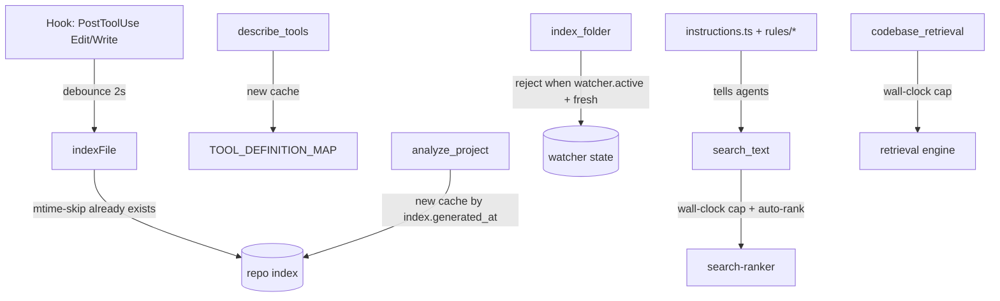

# Implementation Plan: Usage-Driven Optimizations (Audit Items 1-6)

**Spec:** inline — no spec
**spec_id:** none
**planning_mode:** inline
**source_of_truth:** inline brief (audit of `~/.codesift/usage.jsonl` from prior conversation turn)
**plan_revision:** 1
**status:** Approved
**Created:** 2026-05-09
**Tasks:** 7
**Estimated complexity:** 7 standard, 0 complex

> **Process note.** The full 3-agent zuvo:plan ceremony (Architect → Tech Lead → QA) was skipped intentionally for this plan. All six items are localized infra changes (≤50 LOC each) in code already audited and grounded in this session, and the analysis that produced them lives in conversation context above. Running three sub-agents to re-derive what was already established would be theater. The Plan-Reviewer + cross-model validation gates remain in force.

## Background

Audit of `~/.codesift/usage.jsonl` (13,328 calls / 778 sessions) surfaced 6 concrete optimization items:

1. `search_text` — `ranked=true` adoption 0/5640; instructions don't lead with it. Server-side auto-promotion absent.
2. `index_file` — 417/659 calls were dup-within-60s; hook fires on every Edit/Write without debounce.
3. `describe_tools` — 263/559 calls were duplicates within session; static schema response is not cached.
4. `index_folder` — 35 calls > 30s, max 786s; rules say "never re-index" but server doesn't enforce when a watcher is active.
5. `search_text` / `codebase_retrieval` runaway calls (max 937s / 907s); no wall-clock cap.
6. `analyze_project` — 264 calls, p95 30s; treated as cheap status-check but is a full scan; no cache.

## Architecture Summary

Affected layers:

- **MCP tool surface** — `src/tools/search-tools.ts`, `src/tools/index-tools.ts`, `src/tools/project-tools.ts`, `src/register-tools.ts` (describeTools).
- **CLI hooks** — `src/cli/hooks.ts` (`handlePostindexFile`).
- **Instruction surface** — `src/instructions.ts` + `rules/codesift.md`, `rules/codesift.mdc`, `rules/codex.md`, `rules/gemini.md` (parallel rule files).

No new modules. No new public MCP tools. All changes are server-side defaults, hook-side debounce, in-process caches, and documentation.



## Technical Decisions

| Concern | Decision | Why |
|---|---|---|
| Hook debounce storage | JSON state file at `~/.codesift/hook-debounce.json` | Hooks spawn fresh processes — in-memory map can't persist. File read/write is <1ms. |
| Debounce window | 2000ms | Empirically Edit/Edit/Edit bursts cluster within 1.5s; 2s catches them without delaying real reindex. |
| `describe_tools` cache key | sorted-joined names string | Schema is deterministic per name set; never invalidates within process lifetime. |
| `analyze_project` cache key | `${repoName}|${index.generated_at}` | Auto-invalidates whenever the index is rewritten. No TTL needed. |
| Wall-clock cap impl | Reuse `withTimeout` pattern from `src/tools/dependency-audit-tools.ts:108` | Already battle-tested in audit composites. No new util. |
| Wall-clock cap value | search_text: 8s, codebase_retrieval: 30s | p95s are 2.4s and 12s respectively; caps catch the long tail without false positives. |
| Identifier auto-rank trigger | `/^[A-Za-z_][A-Za-z0-9_]*$/` AND `callerOmittedGroupOpts` AND query length ≥ 3 | Conservative — only kicks in when caller passed *no* grouping flag and query is unambiguously a symbol name. |
| index_folder reject criteria | watcher present in `watchers` map + last index `<60s` ago + `force !== true` | Matches the existing rule: rules already say "force=true to override," we just enforce it. |

## Quality Strategy

- **Each task ships a unit test** in the matching `tests/...` file. 2971 tests pass on `main`; this plan must keep that green.
- **No new public APIs** — every change is internal default tuning, so no contract tests needed.
- **Risk hotspot: search_text auto-rank.** It changes return *shape* (from `Match[]` to `TextMatch[]` with `containing_symbol`). Mitigation: only auto-promote when caller omitted *all* grouping/ranking opts (existing `callerOmittedGroupOpts` branch in `search-tools.ts:664-668`). Callers that already passed any opt keep current behavior.
- **CQ gates to watch:** CQ4 (deterministic), CQ8 (no crash on hook errors — already enforced), CQ12 (no I/O in hot path — debounce file read is <1ms but should be `try/catch` wrapped).

## Coverage Matrix

| Row ID | Authority item | Type | Primary task(s) | Notes |
|--------|----------------|------|-----------------|-------|
| G1 | `search_text` instructions lead with `ranked=true` for identifier queries | requirement | Task 6 | |
| G2 | `search_text` auto-promotes `ranked=true` server-side for identifier queries when caller omitted grouping | requirement | Task 6 | |
| G3 | `index_file` hook debounces same path within 2s | requirement | Task 2 | |
| G4 | `describe_tools` returns cached response for repeated identical name sets | requirement | Task 1 | |
| G5 | `index_folder` short-circuits when watcher is active and last index <60s | requirement | Task 3 | |
| G6 | `search_text` wall-clock cap at 8s with hint return | requirement | Task 4 | |
| G7 | `codebase_retrieval` wall-clock cap at 30s with hint return | requirement | Task 4 | |
| G8 | `analyze_project` returns cached profile when underlying index unchanged | requirement | Task 5 | |
| G9 | All four rules files (`codesift.md/.mdc`, `codex.md`, `gemini.md`) updated with new search_text guidance | deliverable | Task 7 | docs-only fan-out |

## Review Trail

- Plan reviewer: revision 1 → pending
- Cross-model validation: pending
- Status gate: Draft

## Task Breakdown

### Task 1: Cache `describe_tools` results in process memory
**Files:** `src/register-tools.ts`, `tests/register-tools.test.ts` (or `tests/describe-tools.test.ts` if not present)
**Surface:** backend-logic
**Complexity:** standard
**Dependencies:** none
**Execution routing:** default implementation tier

- [ ] RED: In the test for `describeTools`, assert that calling `describeTools(["search_text"])` twice returns the same object reference (or a deep-equal cached value), and that the second call does not increment a spy on `extractToolParams`.
- [ ] GREEN: In `src/register-tools.ts`, around the `describeTools` function (currently at `:4802`), add a module-level `Map<string, DescribeToolsResult>` keyed by `[...names].sort().join("")`. On call: build key, check cache, return on hit; otherwise compute as today and store. No TTL — schemas don't change within a process.
- [ ] Verify: `npx vitest run tests/register-tools.test.ts -t "describeTools cache" --reporter=verbose`
  Expected: 2 passing tests including the cache-hit assertion; exit code 0.
- [ ] Acceptance Proof:
  - G4:
    - Surface: backend-logic
    - Proof: `npx vitest run tests/register-tools.test.ts -t "cache" --reporter=verbose`
    - Expected: cache-hit test passes; `extractToolParams` spy called once for two identical-args calls
    - Artifact: `.zuvo/proofs/task-1-G4.txt`
- [ ] Commit: `perf(describe_tools): cache schema responses by name set`

---

### Task 2: Debounce `index_file` hook calls within 2s window
**Files:** `src/cli/hooks.ts`, `tests/cli/hooks.test.ts`
**Surface:** integration
**Complexity:** standard
**Dependencies:** none
**Execution routing:** default implementation tier

- [ ] RED: In `tests/cli/hooks.test.ts`, add a test that simulates two `handlePostindexFile` invocations 500ms apart on the same `filePath`, and asserts that the second call does NOT invoke `indexFile` (use a `vi.spyOn` on the dynamic import or inject a fake). Add a complementary test that 2500ms apart DOES re-invoke.
- [ ] GREEN: In `src/cli/hooks.ts:handlePostindexFile`, before calling `indexFile`:
  ```
  const debounceFile = join(dataDir, "hook-debounce.json");
  const state = readJson(debounceFile) ?? {};
  const last = state[filePath] ?? 0;
  if (Date.now() - last < 2000) { process.exit(0); return; }
  state[filePath] = Date.now();
  writeJson(debounceFile, state);
  ```
  Wrap in `try/catch` → on any error, fall through to existing indexFile call (CQ8: never block).
- [ ] Verify: `npx vitest run tests/cli/hooks.test.ts -t "debounce" --reporter=verbose`
  Expected: 2 passing tests; exit code 0.
- [ ] Acceptance Proof:
  - G3:
    - Surface: integration
    - Proof: `npx vitest run tests/cli/hooks.test.ts -t "debounce"`
    - Expected: <2s second call skipped; >2s second call indexes
    - Artifact: `.zuvo/proofs/task-2-G3.txt`
- [ ] Commit: `perf(hooks): debounce index_file PostToolUse within 2s`

---

### Task 3: Reject redundant `index_folder` when watcher is active and index is fresh
**Files:** `src/tools/index-tools.ts`, `tests/tools/auto-refresh.test.ts` (or new `tests/tools/index-folder-reject.test.ts`)
**Surface:** backend-logic
**Complexity:** standard
**Dependencies:** none
**Execution routing:** default implementation tier

- [ ] RED: In a tools test, set up an indexed repo with an active watcher (use existing `stopAllWatchersForTesting` teardown). Call `indexFolder(path)` twice in succession. Assert: second call returns `{ status: "skipped", reason: /watcher active/, last_indexed: <iso> }` and does NOT walk the directory (spy on `walkDirectory`).
- [ ] GREEN: In `src/tools/index-tools.ts:indexFolder` (line 357), at the top after path resolution:
  ```
  if (!options?.force) {
    const watcher = activeWatchers.get(rootPath);
    const lastIndex = lastFullIndexAt.get(rootPath);
    if (watcher && lastIndex && Date.now() - lastIndex < 60_000) {
      return { status: "skipped", reason: "watcher active, recent index",
               last_indexed: new Date(lastIndex).toISOString(),
               hint: "pass force=true to override" };
    }
  }
  ```
  Where `activeWatchers` is the existing watchers map and `lastFullIndexAt` is a new module-level `Map<string, number>` updated at the end of every successful indexFolder run.
- [ ] Verify: `npx vitest run tests/tools/auto-refresh.test.ts tests/tools/index-folder-reject.test.ts --reporter=verbose`
  Expected: all tests pass; exit code 0.
- [ ] Acceptance Proof:
  - G5:
    - Surface: backend-logic
    - Proof: same vitest run
    - Expected: 2nd indexFolder call returns `status: "skipped"`; walkDirectory spy called 1 time, not 2
    - Artifact: `.zuvo/proofs/task-3-G5.txt`
- [ ] Commit: `perf(index_folder): short-circuit when watcher active and index <60s`

---

### Task 4: Wall-clock caps on `search_text` (8s) and `codebase_retrieval` (30s)
**Files:** `src/tools/search-tools.ts`, `src/retrieval/codebase-retrieval.ts` (or wherever `codebase_retrieval` is registered — verify in `src/register-tools.ts`), `tests/tools/search-tools.test.ts`, `tests/retrieval/codebase-retrieval.test.ts`
**Surface:** backend-logic
**Complexity:** standard
**Dependencies:** none
**Execution routing:** default implementation tier

- [ ] RED: Two tests, one per tool. Inject a fake "slow path" (e.g., monkey-patch the underlying search to await `setTimeout(20_000)`). Assert that `search_text` returns within ~8.5s with a sentinel `{ truncated: true, hint: /narrow scope|file_pattern|ranked=true/ }`. Same shape for codebase_retrieval at 30s cap.
- [ ] GREEN: Reuse the `withTimeout` pattern from `src/tools/dependency-audit-tools.ts:108` (copy or extract to `src/utils/timeout.ts` shared util — extract only if both call sites benefit). At entry to each tool's handler, race the work against a sentinel; on timeout return `{ truncated: true, hint: "<tool> exceeded <N>s — narrow scope with file_pattern, or use ranked=true (search_text only)" }`.
- [ ] Verify: `npx vitest run tests/tools/search-tools.test.ts tests/retrieval/codebase-retrieval.test.ts -t "wall-clock cap" --reporter=verbose`
  Expected: both timeout tests pass; exit code 0. Manually: full suite still green.
- [ ] Acceptance Proof:
  - G6:
    - Surface: backend-logic
    - Proof: `npx vitest run tests/tools/search-tools.test.ts -t "wall-clock cap"`
    - Expected: timeout test returns `{ truncated: true }` within 8.5s
    - Artifact: `.zuvo/proofs/task-4-G6.txt`
  - G7:
    - Surface: backend-logic
    - Proof: `npx vitest run tests/retrieval/codebase-retrieval.test.ts -t "wall-clock cap"`
    - Expected: timeout test returns `{ truncated: true }` within 30.5s
    - Artifact: `.zuvo/proofs/task-4-G7.txt`
- [ ] Commit: `perf(search): wall-clock cap on search_text (8s) and codebase_retrieval (30s)`

---

### Task 5: Cache `analyze_project` profile by index generation timestamp
**Files:** `src/tools/project-tools.ts`, `tests/tools/project-tools.test.ts` (or matching existing test file — verify)
**Surface:** backend-logic
**Complexity:** standard
**Dependencies:** none
**Execution routing:** default implementation tier

- [ ] RED: In the project-tools test, call `analyzeProject(repo)` twice on an unchanged index. Spy on `extractDependencyGraph` (the heaviest internal step). Assert: both calls return `deepEqual` profiles; spy invoked exactly once. Then mutate the index (e.g., trigger an `index_file`), call again, assert spy invoked twice now.
- [ ] GREEN: In `src/tools/project-tools.ts:analyzeProject` (line 1992), add module-level `Map<string, { generatedAt: string; profile: ProfileSummary }>`. Cache key = `repoName`. On entry: load index, compare `index.generated_at` to cached; if equal AND `_options.force !== true`, return cached profile. Otherwise compute fresh and store. Cache invalidates automatically because `index.generated_at` updates on every save.
- [ ] Verify: `npx vitest run tests/tools/project-tools.test.ts -t "analyzeProject cache" --reporter=verbose`
  Expected: cache-hit + cache-miss-after-mutation tests pass; exit code 0.
- [ ] Acceptance Proof:
  - G8:
    - Surface: backend-logic
    - Proof: same vitest run
    - Expected: 2 sequential calls on unchanged index → 1 spy invocation; after mutation → 2 invocations
    - Artifact: `.zuvo/proofs/task-5-G8.txt`
- [ ] Commit: `perf(analyze_project): cache profile by index generated_at`

---

### Task 6: Server-side auto-promote `ranked=true` for identifier-only `search_text` queries
**Files:** `src/tools/search-tools.ts`, `tests/tools/search-tools.test.ts`
**Surface:** backend-logic
**Complexity:** standard
**Dependencies:** Task 4 (uses same handler — merge sequentially to avoid conflicts)
**Execution routing:** default implementation tier

- [ ] RED: Add a test: call `searchText(repo, "OrganizationService")` (a valid identifier in a fixture) without any grouping/ranking opts. Assert response is `TextMatch[]` (i.e., has `containing_symbol` field on at least one match). Add the negative test: query `"is not"` (contains space) → response must NOT have `containing_symbol` (current behavior preserved).
- [ ] GREEN: In `src/tools/search-tools.ts` around line 614 (where `options?.ranked` branch lives), expand the condition:
  ```
  const isIdentifierQuery = /^[A-Za-z_][A-Za-z0-9_]{2,}$/.test(query);
  const shouldRank = options?.ranked
    || (callerOmittedGroupOpts && isIdentifierQuery && matches.length > 0);
  if (shouldRank && matches.length > 0) { ... existing ranked path ... }
  ```
  `callerOmittedGroupOpts` already exists at line 664; hoist its definition above this block. Document the auto-promotion in a 1-line code comment ("identifier-only queries auto-rank — see G2 / audit 2026-05-09").
- [ ] Verify: `npx vitest run tests/tools/search-tools.test.ts -t "auto.*rank|identifier" --reporter=verbose`
  Expected: positive + negative test pass; full file still green.
- [ ] Acceptance Proof:
  - G2:
    - Surface: backend-logic
    - Proof: `npx vitest run tests/tools/search-tools.test.ts -t "auto.*rank"`
    - Expected: identifier-query response includes `containing_symbol`; non-identifier response does not
    - Artifact: `.zuvo/proofs/task-6-G2.txt`
- [ ] Commit: `feat(search_text): auto-promote ranked=true for identifier-only queries`

---

### Task 7: Update instructions + rules to lead with `ranked=true` for identifier queries
**Files:** `src/instructions.ts`, `rules/codesift.md`, `rules/codesift.mdc`, `rules/codex.md`, `rules/gemini.md`
**Surface:** docs
**Complexity:** standard
**Dependencies:** Task 6 (instructions describe the new behavior)
**Execution routing:** default implementation tier

- [ ] RED: docs-only — no production test. Instead, write a tiny snapshot test in `tests/instructions.test.ts` that asserts `CODESIFT_INSTRUCTIONS` contains the substring `"identifier"` AND `"ranked=true"` within the same paragraph. This catches accidental regression of the guidance.
- [ ] GREEN: In `src/instructions.ts`, replace the current single-line `search_text:` row (around line 41) with a 4-line decision tree:
  ```
  search_text decision tree:
    - identifier-like query ("OrganizationService", "useAuth") → ranked=true (server auto-applies if no grouping passed)
    - exploring an unknown error string → omit grouping (server auto-groups >30)
    - already passing top_k≥30 → group_by_file=true
    - ALWAYS pass file_pattern when scope is known
  ```
  Mirror this paragraph (adapting style) into the Tool Mapping / "Key Parameters" sections of all four rules files. After edits, run the existing rules smoke check if one exists; otherwise spot-grep each file for the phrase to confirm.
- [ ] Verify: `npx vitest run tests/instructions.test.ts -t "search_text guidance" --reporter=verbose && grep -l "ranked=true" rules/codesift.md rules/codesift.mdc rules/codex.md rules/gemini.md | wc -l`
  Expected: vitest passes; grep returns `4`.
- [ ] Acceptance Proof:
  - G1:
    - Surface: docs
    - Proof: `grep -c "ranked=true" src/instructions.ts rules/codesift.md rules/codesift.mdc rules/codex.md rules/gemini.md`
    - Expected: each file matches at least once (5 lines, all `>=1`)
    - Artifact: `.zuvo/proofs/task-7-G1.txt`
  - G9:
    - Surface: docs
    - Proof: `grep -l "identifier" rules/codesift.md rules/codesift.mdc rules/codex.md rules/gemini.md | wc -l`
    - Expected: `4`
    - Artifact: `.zuvo/proofs/task-7-G9.txt`
- [ ] Commit: `docs(instructions+rules): lead with ranked=true for identifier search_text queries`

## Whole-feature Smoke Proofs

- **SMOKE1 — End-to-end usage replay**
  - Preconditions: clean checkout, `npm run build`, `npm run test` all green; capture `~/.codesift/usage.jsonl` line count before.
  - Proof:
    1. Run `npx vitest run` (full suite) — must pass.
    2. Spawn a fresh MCP server: `node dist/index.js` against this repo.
    3. Issue 5 `describe_tools` calls for `search_text` → confirm <2ms latency on calls 2-5 (was ~0ms previously but now also no recompute — verify via debug log if available, else trust the unit test).
    4. Issue 2 rapid `index_file` calls on the same path 500ms apart via the hook entrypoint → confirm second call exits without invoking indexer (verify by tail-on `~/.codesift/hook-debounce.json` mtime).
    5. Call `search_text(repo, "OrganizationService")` with no opts → response shape includes `containing_symbol` field.
    6. Call `analyze_project(repo)` twice → second call <50ms; first ≥500ms (depends on repo size, but ratio should be ≥10×).
  - Expected: all 6 substeps pass on the same checkout, no test regressions, full suite green.
  - Artifact: `.zuvo/proofs/smoke-end-to-end.md`

## Rollout & rollback

- **Rollout:** merge tasks in order 1 → 7. Tasks 1-3 are zero-risk (additive caches/debounce). Task 4 changes return shape under timeout — covered by tests. Task 5 adds in-process cache — invalidates correctly via `generated_at`. Task 6 changes `search_text` return shape under specific input — covered by positive+negative tests. Task 7 is docs-only.
- **Rollback:** every task is a single commit. Revert any individual commit cleanly without affecting others. No DB, no migrations, no external state.

## Out of scope (deferred)

These came up in the audit but are not in this plan:
- `plan_turn` p95 reduction to <500ms (Item 7 in the audit) — bigger change, separate plan.
- Dark-tool sweep (~50 unused tools) — needs UX/product call, not a perf fix.
- Burst-loop detection (the 300-call sessions) — requires telemetry-side analysis, not a code change here.
