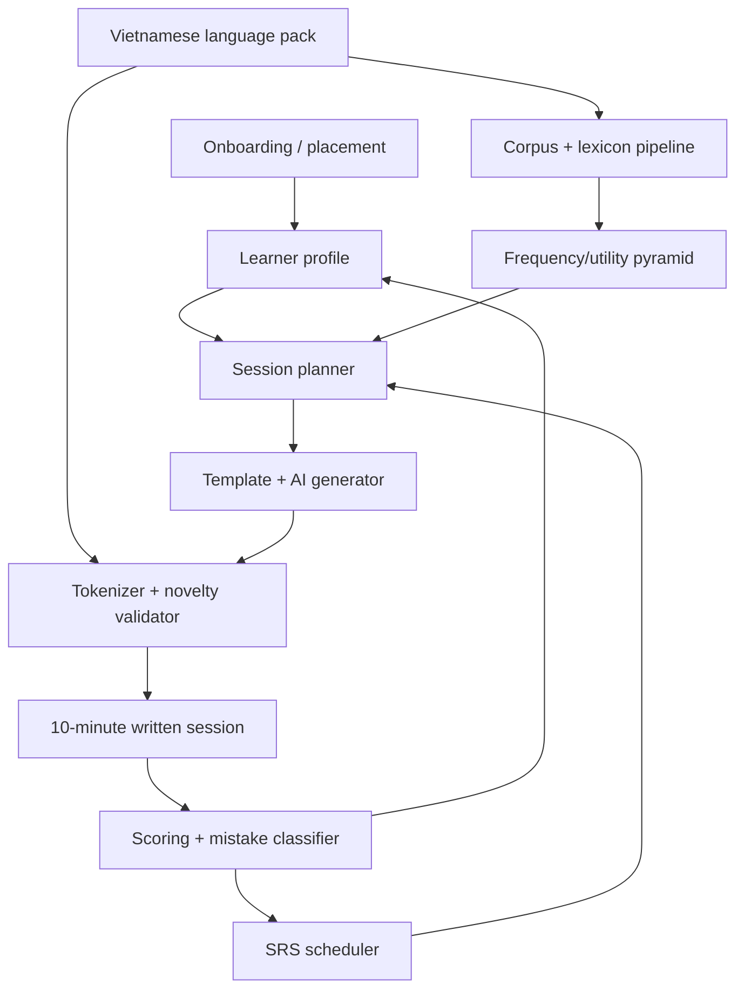

# AI Language Learning V1 -- Design Specification

> **spec_id:** 2026-06-06-ai-language-learning-v1-1054
> **topic:** AI language learning v1
> **status:** Reviewed
> **created_at:** 2026-06-06T10:54:17Z
> **reviewed_at:** 2026-06-06T11:37:12Z
> **approved_at:** null
> **approval_mode:** async
> **adversarial_review:** warnings
> **author:** zuvo:brainstorm

## Problem Statement

Language learners with only 5-10 minutes per day are poorly served by static flashcards, fixed curricula, and unconstrained AI chats. Static SRS tools repeat the same card shape; course apps often hide the learner's real vocabulary model; open-ended AI tutors can generate material far beyond the learner's level. For Vietnamese, naive word counting is especially weak because spaces mark syllables more reliably than lexical words, and tones/diacritics are central to meaning.

This v1 designs a text-only AI learning app that builds a learner-specific vocabulary pyramid from frequency, utility, and current knowledge. It starts with Vietnamese as the first production language while keeping the core language-agnostic. The product teaches through controlled written input and retrieval: each session uses mostly known items, adds a tiny target set, generates many validated contexts, records mistakes, and schedules future reviews.

If we do nothing, the user can approximate the workflow with LingQ + Anki + ChatGPT, but the core idea remains manual: importing texts, estimating known words, writing prompts, checking generated examples for unknown leakage, and deciding what to review next.

## Research Summary

### Market Scan

The market has strong partial precedents but no clear product that combines all requested constraints for Vietnamese:

| Product family | Examples | Relevant strength | Gap for this v1 |
|----------------|----------|-------------------|-----------------|
| Gamified fixed curriculum | Duolingo, Babbel, Busuu, Mondly | Beginner progression, habit loop, broad reach | Usually fixed path; weak learner-owned corpus and known-word control |
| Immersion/direct method | Berlitz, Rosetta Stone | Context and meaning before explicit grammar | Expensive or fixed content; not frequency/personal-corpus first |
| Audio-first oral fluency | Pimsleur, Glossika | Spaced recall, anticipation, sentence repetition | Not text-first; weak custom corpus/known-vocabulary modeling |
| Real-content readers | LingQ, Lector, ELVocab, PlusOneLanguage | Imported content, known/unknown word tracking, i+1 style reading | Less emphasis on active generated retrieval and strict novelty validation |
| Adaptive vocab/SRS/cloze | Anki/FSRS, Lingvist, Clozemaster, FreeLingo, Palabring, Repetium | Frequency, SRS, review automation, contextual examples | Often card/sentence static; limited Vietnamese-specific segmentation and AI validator |
| AI conversation/pronunciation | Duolingo Max, TalkPal, Praktika, ELSA, Memrise MemBot | Roleplay, speech practice, feedback | Crowded and expensive; not the v1 written wedge |

Sources used include Duolingo Max's AI roleplay/explanation model, Pimsleur's graduated interval recall and core vocabulary method, Berlitz's target-language immersion method, Rosetta Stone Dynamic Immersion, Clozemaster frequency-tracked cloze practice, LingQ Vietnamese SRS/context learning, Lingvist's frequency/SRS positioning, and Anki FSRS documentation.

### Learning Science

Evidence supports the chosen blend:

- Spaced repetition remains a strong retention mechanism; Anki's FSRS documentation describes scheduling around predicted forgetting rather than fixed SM-2 intervals.
- Retrieval practice matters more than passive re-exposure. The Cambridge review of adult L2 vocabulary training notes that successful repetition depends on factors including retrieval practice and spacing, and that retrieval practice can improve speed/accuracy versus simple repetition.
- Corpus use has evidence for vocabulary learning: a multilevel meta-analysis reports medium positive effects for short-term and long-term L2 vocabulary learning.
- Lexical coverage matters. Recent Cambridge work summarizes prior reading research around 95-98% known-word coverage for adequate comprehension, with topic familiarity also important.
- For tonal languages, pronunciation is not generic. A Frontiers review on L2 lexical tone acquisition argues that multimodal cues can support tone acquisition. This supports adding per-word pronunciation and later sentence audio after the written system is stable.
- Emerging LLM+SRS research, such as LECTOR, supports the direction of combining personalized profiles, semantic confusion modeling, and spaced repetition, but the paper is new and should be treated as research signal, not production proof.

### Vietnamese-Specific Findings

Vietnamese requires a language pack rather than a generic whitespace tokenizer:

- VnCoreNLP provides Vietnamese word segmentation, POS tagging, NER, and dependency parsing; its examples segment multi-syllable lexical items with underscores.
- Underthesea provides Vietnamese word segmentation, POS tagging, NER, language detection, and TTS in a Python toolkit.
- Frequency data exists, including Vietnamese Lab lists and CVT/SDSU corpus word lists, but v1 should treat public lists as seed material and build its own curated starter lexicon plus corpus-derived ranks.

## Design Decisions

### D1 -- Product Wedge

[AUTO-DECISION] Choose a text-first controlled-input trainer, not a generic AI tutor.

Why: Duolingo/TalkPal/Praktika/ELSA already compete around roleplay and speech. The user's idea is strongest where current tools are weakest: controlled generation from the learner's actual known vocabulary, with a Vietnamese-aware tokenizer and strict novelty budget.

Alternatives considered:

- Open-ended AI chat: fast to prototype, but hard to validate pedagogically and likely to leak unknown language.
- Duolingo-style path: familiar UX, but expensive content production and less distinct.
- Audio-first Pimsleur clone: pedagogically strong, but contradicts the v1 written-only constraint.

### D2 -- Language Architecture

[AUTO-DECISION] Use a language-agnostic core plus versioned language packs. Vietnamese is the only production pack in v1.

Why: "Open to all languages" cannot mean one tokenizer/frequency model. The core owns sessions, learner state, scheduling, content validation, and exercise generation. The language pack owns tokenization, lexicon, frequency data, orthography rules, pronunciation metadata, and pack-specific validators.

### D3 -- Knownness Model

[AUTO-DECISION] Represent "known" as multiple scores, not a boolean.

Knownness dimensions:

- `recognition_score`: understands when seen.
- `production_score`: can produce in a constrained prompt.
- `orthography_score`: can write/type accurately with diacritics.
- `context_score`: understands in sentence context.
- `confidence`: model confidence in the estimate.
- `source`: placement, user override, exercise result, or admin seed.

Why: heritage learners, lucky guesses, and tone-mark errors make boolean known/unknown brittle.

### D4 -- Zero-Knowledge Start

[AUTO-DECISION] If onboarding detects true zero knowledge, start from a curated foundation pack, not AI-generated arbitrary content.

Zero path:

1. Pick target dialect/default: v1 default is shared-core Vietnamese with explicit dialect metadata, not dialect-specific pronunciation scoring.
2. Define a day-1 foundation pool of 8-12 high-utility primitives: greetings, yes/no, wants/needs, food/drink, pronouns handled cautiously, and question frames.
3. Each exercise block reuses targets from the session's novelty budget; it does not introduce new items beyond the per-session cap in IC-2.
4. The first session introduces only the first 2 lexical items and 1 skill node from that pool, per Integration Contract IC-2.
5. Use templates first, AI paraphrases second, and validator gating always.
6. Defer heavy grammar. Show only short pattern notes when a mistake repeats.

Zero-start bootstrap semantics: a true zero-start learner begins with no `known` items, but the first session's 2 target lexical items are inserted as `introduced` states with `source="seed"` and included in `NoveltyBudget.allowedItemIds`. They are not treated as `known`; they are allowed for controlled examples because they are the current teaching targets.

Zero-start promotion: after the learner reaches `known` or `learning` status on at least 12 foundation lexical items and 3 foundation skill nodes, the planner applies the normal IC-2 novelty budget while preserving `placementBranch="zero_start"` as historical metadata.

### D5 -- Generation Strategy

[AUTO-DECISION] Hybrid templates + LLM generation, always followed by deterministic validation.

Why: pure templates are safe but repetitive; pure LLM is flexible but unsafe. The generator may create candidate sentences/dialogues, but the validator rejects anything outside the allowed vocabulary/pattern budget before the learner sees it.

### D6 -- SRS Strategy

[AUTO-DECISION] Implement an FSRS-compatible scheduling abstraction, but do not require a full FSRS optimizer in v1.

Why: v1 needs scheduling at both item and skill level. A simple retrievability/stability/difficulty model can be tested deterministically, and the schema can later adopt FSRS parameters or interoperate with Anki-like exports.

### D7 -- Pronunciation Roadmap

[AUTO-DECISION] Store pronunciation metadata in v1 but do not require speech input/output in v1.

Why: the user explicitly wants future per-word pronunciation and sentence assembly from word pronunciations. V1 should include fields such as IPA, audio asset URL, dialect, tone label, and syllable segmentation. TTS, speech recognition, and tone scoring are v2.

### D8 -- Implementation Shape

[AUTO-DECISION] V1 delivery target is a standalone web app with a backend API and persistent learner state; this repo stores the design spec only unless the user later chooses to create a new app workspace here.

Why: the current repo is an MCP/code-intelligence server, not a learning app. It does have useful patterns: frequency mining, multilingual embeddings, local file persistence, strict prompt validation, and Vitest tests, but the product requires a learner-facing UI and API. `zuvo:plan` should therefore plan a standalone app/service implementation, not new MCP tools, unless the user explicitly changes scope.

## Solution Overview

The app maintains a learner profile, a versioned language pack, and a session engine. Onboarding estimates the learner's known vocabulary through a quick placement test and optional self-marking. The session planner chooses due reviews and a small set of new targets. The content generator creates written exercises and micro-dialogues using the known set plus the target set. The validator tokenizes generated content using the language pack and rejects content that exceeds the novelty budget. The scorer updates learner state, mistake classes, and SRS schedules.



## Detailed Design

### Data Model

#### `LearnerProfile`

```ts
interface LearnerProfile {
  id: string;
  targetLanguagePackId: string;       // "vi"
  activeLanguagePackVersion: string;
  uiLanguage: string;                 // e.g. "pl" or "en"
  placementStatus: "not_started" | "in_progress" | "classified";
  placementBranch?: PlacementBranch;
  targetDialect: "shared-core";       // locked for v1
  dailyTargetMinutes: 10;
  createdAt: string;
  updatedAt: string;
}

type PlacementBranch = "zero_start" | "heritage_or_spoken" | "non_zero_written";
```

#### `PlacementResult`

```ts
interface PlacementResult {
  learnerId: string;
  branch: PlacementBranch;
  estimatedLevel: "absolute_beginner" | "early_beginner" | "beginner" | "mixed_heritage";
  knownItemStates: LearnerItemState[];
  weakItemStates: LearnerItemState[];
  zeroStart: boolean;
  confidence: number;
  evidence: PlacementEvidence[];
}

interface PlacementEvidence {
  type: "self_report" | "recognition_probe" | "production_probe" | "orthography_probe";
  itemId?: string;
  result: "correct" | "partial" | "incorrect" | "skipped" | "override";
}
```

#### `PlacementSession`, `PlacementProbe`, And `PlacementAnswer`

```ts
interface PlacementSession {
  id: string;
  learnerId: string;
  status: "active" | "classified" | "abandoned";
  probeIds: string[];
  answeredProbeIds: string[];
  answers: PlacementAnswerRecord[];
  candidateBranch?: PlacementBranch;
  maxProbes: number;                 // v1 default: 12
  startedAt: string;
  classifiedAt?: string;
}

interface PlacementProbe {
  id: string;
  placementSessionId: string;
  kind: "self_report" | "recognition_choice" | "translation_choice" | "cloze" | "typed_recall" | "orthography_check";
  itemIds: string[];
  prompt: string;
  choices?: Array<{ id: string; label: string }>;
  expectedAnswer?: AnswerKey;
  branchSignal: {
    zeroStartWeight: number;
    heritageWeight: number;
    nonZeroWrittenWeight: number;
  };
}

type PlacementAnswer =
  | { type: "choice"; choiceId: string }
  | { type: "typed"; text: string }
  | { type: "self_rating"; rating: "none" | "recognize" | "can_use" | "spoken_only" }
  | { type: "skip" };

interface PlacementAnswerRecord {
  probeId: string;
  answer: PlacementAnswer;
  result: "correct" | "partial" | "incorrect" | "skipped";
  branchScores: {
    zeroStart: number;
    heritageOrSpoken: number;
    nonZeroWritten: number;
  };
  submittedAt: string;
}
```

Placement starts with a self-report probe, then alternates recognition and orthography probes. It returns `placementResult` instead of `nextProbe` when any condition holds: (a) two consecutive early probes are incorrect/skipped, producing `zero_start`; (b) spoken-only/self-report plus weak orthography evidence produces `heritage_or_spoken`; (c) confidence reaches `>=0.80` for any branch after at least 5 probes; or (d) `maxProbes` is reached. Otherwise it returns `nextProbe`.

#### `KnownWordList`

```ts
interface KnownWordList {
  learnerId: string;
  languagePackId: string;
  languagePackVersion: string;
  items: KnownWordListItem[];
  counts: {
    known: number;
    introduced: number;
    learning: number;
    unknown: number;
    suspended: number;
  };
}

interface KnownWordListItem {
  itemId: string;
  surface: string;
  gloss: string;
  kind: "word" | "phrase" | "pattern";
  status: LearnerItemState["status"];
  recognitionScore: number;
  productionScore: number;
  orthographyScore: number;
  contextScore: number;
  nextReviewAt?: string;
  source: LearnerItemState["source"];
}
```

`GET /known-words` supports `status` filters for `known`, `introduced`, `learning`, `unknown`, and `suspended`. `introduced` is not collapsed into `learning`; it remains a separate bucket so users can see items first shown today.

#### `LanguagePack`

```ts
interface LanguagePack {
  id: string;                 // "vi"
  version: string;            // semver, e.g. "1.0.0"
  displayName: string;        // "Vietnamese"
  defaultDialect: string;     // "shared-core"
  tokenizer: TokenizerConfig;
  orthography: OrthographyConfig;
  pronunciationSupport: PronunciationSupport;
  sourceRefs: SourceRef[];
}
```

#### `TokenizerConfig`

```ts
interface TokenizerConfig {
  strategy: "python_sidecar";
  protocol: "http_localhost";
  serviceName: "underthesea";
  timeoutMs: number;                  // v1 default: 3000
  corpusTimeoutMs: number;            // v1 default: 30000 for chunked async corpus jobs
  fallbackMode: "pre_validated_templates";
  multiwordJoiner?: string;           // e.g. "_" for debug display only
}
```

V1 uses a co-located HTTP localhost Python sidecar wrapping Underthesea for Vietnamese segmentation. The app starts and supervises the sidecar at boot, exposes `/healthz` and `/segment` endpoints, keeps one warm worker process for v1, and budgets cold start outside user session planning. VnCoreNLP remains an evaluation candidate but is not the v1 default because the standalone app/API target should avoid a Java runtime unless later benchmarking justifies it. If tokenization is unavailable, dynamically generated content validation fails closed with `tokenization_error`; template fallback can still serve only exercises that were pre-tokenized and pre-validated at language-pack build time. Whitespace fallback is forbidden by IC-3.

#### `LexicalItem`

```ts
interface LexicalItem {
  id: string;
  languagePackId: string;
  skillNodeId?: string;
  surface: string;            // e.g. "muốn"
  normalized: string;
  segmented: string[];        // Vietnamese lexical segmentation
  kind: "word" | "phrase" | "pattern";
  gloss: string;
  frequencyRank?: number;
  utilityRank?: number;
  difficulty: 1 | 2 | 3 | 4 | 5;
  prerequisites: string[];
  tags: string[];             // food, greeting, question, pronoun, tone-minimal-pair
  pronunciation?: PronunciationMetadata;
  examples: ExampleSeed[];
}
```

#### `LearnerItemState`

```ts
interface LearnerItemState {
  learnerId: string;
  itemId: string;
  languagePackId: string;
  languagePackVersion: string;
  recognitionScore: number;   // 0..1
  productionScore: number;    // 0..1
  orthographyScore: number;   // 0..1
  contextScore: number;       // 0..1
  structuralSupportExposureCount?: number;
  confidence: number;         // 0..1 model confidence
  status: "unknown" | "introduced" | "learning" | "known" | "suspended";
  nextReviewAt?: string;
  stability?: number;
  difficulty?: number;
  lastSeenAt?: string;
  source: "placement" | "exercise" | "override" | "seed";
  version: number;
}
```

#### `SkillNode`

```ts
interface SkillNode {
  id: string;
  languagePackId: string;
  type: "pattern" | "orthography" | "tone_mark" | "register" | "pronoun_frame";
  label: string;
  prerequisites: string[];
  noveltyCost: number;
}
```

#### `LearnerSkillState`

```ts
interface LearnerSkillState {
  learnerId: string;
  skillNodeId: string;
  languagePackId: string;
  languagePackVersion: string;
  status: "unknown" | "introduced" | "learning" | "known" | "suspended";
  confidence: number;
  nextReviewAt?: string;
  source: "placement" | "exercise" | "override" | "seed";
}
```

Patterns can exist as `LexicalItem.kind="pattern"` when they are shown or practiced as text. `SkillNode` tracks pedagogical constraints for planning. When a pattern is both a lexical item and a skill, the language pack must link them through `LexicalItem.prerequisites` or `SkillNode.prerequisites`; planner novelty uses `SkillNode`, while lexical coverage uses `LexicalItem`.

#### `SessionPlan`

```ts
interface SessionPlan {
  id: string;
  learnerId: string;
  targetDurationMinutes: 10;
  estimatedDurationMinutes: number;
  languagePackId: string;
  languagePackVersion: string;
  reviewItemIds: string[];
  newItemIds: string[];
  skillNodeIds: string[];
  noveltyBudget: NoveltyBudget;
  exerciseIds: string[];
  status: "planned" | "started" | "completed" | "abandoned";
}
```

#### `NoveltyBudget`

```ts
interface NoveltyBudget {
  maxNewLexicalItems: number;
  maxNewSkillNodes: number;
  maxStructuralSupportItems: number;
  minAllowedTokenCoverage: number;
  allowedItemIds: string[];
  targetItemIds: string[];
  structuralSupportItemIds: string[];
}
```

#### `Exercise`

```ts
interface Exercise {
  id: string;
  sessionPlanId: string;
  type: "recognition" | "cloze" | "translation" | "constrained_production" | "mini_dialogue";
  prompt: string;
  targetText: string;
  allowedItemIds: string[];
  targetItemIds: string[];
  languagePackId: string;
  languagePackVersion: string;
  declaredSkillNodeIds: string[];
  generationMode: "template" | "ai_generated" | "template_fallback";
  preValidatedTokenization?: ValidationReport;
  validationReport: ValidationReport;
  answerKey: AnswerKey;
}
```

AI-generated exercises in v1 are restricted to closed-set or bounded-answer formats: `recognition`, `cloze`, and choice-based variants whose `AnswerKey` can be generated and validated deterministically. Open-ended `translation`, free-text `constrained_production`, and `mini_dialogue` exercises are allowed only when they come from pre-authored or pre-validated templates with explicit accepted variants. V2 may add semantic scoring.

#### `AnswerKey`, `ScoreResult`, And Review Preview`

```ts
interface AnswerKey {
  canonical: string;
  acceptedVariants: string[];
  targetItemIds: string[];
  scoringMode: "exact" | "normalized_text" | "choice";
  partialCreditRules: Array<{
    rule: "diacritic_missing" | "tone_mark_wrong" | "minor_word_order" | "accepted_gloss";
    maxCredit: number;               // 0..1
  }>;
}

type MistakeClass =
  | "none"
  | "orthography_diacritic_missing"
  | "orthography_tone_mark_wrong"
  | "wrong_lexical_choice"
  | "wrong_pattern"
  | "unknown_answer"
  | "acceptable_variant"
  | "too_much_unknown_language";

interface ScoreResult {
  exerciseId: string;
  answerAttemptId: string;
  score: number;                     // 0..1
  recognized: boolean;
  produced: boolean;
  mistakeClasses: MistakeClass[];
  dimensionEffects: {
    recognitionDelta: number;
    productionDelta: number;
    orthographyDelta: number;
    contextDelta: number;
  };
  explanation: string;
}

interface NextReviewPreview {
  itemId: string;
  previousReviewAt?: string;
  nextReviewAt: string;
  stability?: number;
  difficulty?: number;
}
```

#### `AnswerAttemptRecord` / Review Log

```ts
interface AnswerAttemptRecord {
  answerAttemptId: string;
  learnerId: string;
  sessionId: string;
  exerciseId: string;
  itemIds: string[];
  answer: string | PlacementAnswer;
  scoreResult: ScoreResult;
  createdAt: string;
  languagePackId: string;
  languagePackVersion: string;
}
```

Every scored learner interaction writes an `AnswerAttemptRecord` before mutating current `LearnerItemState`. SRS can recompute stability/difficulty from this log, and idempotency is enforced by `answerAttemptId`.

#### `ValidationReport`

```ts
interface ValidationReport {
  status: "accepted" | "rejected";
  allowedTokenCoverage: number;
  unknownLexicalItemIds: string[];
  unknownSkillNodeIds: string[];
  violations: Array<{
    type: "unknown_lexical_item" | "unknown_skill_node" | "coverage_below_minimum" | "tokenization_error" | "unsafe_content";
    value: string;
  }>;
}
```

V1 deterministic validation checks lexical coverage and declared skill metadata only. It must not infer abstract pedagogical skill nodes such as register or pronoun frames from arbitrary raw text. `unknownSkillNodeIds` is computed from `Exercise.declaredSkillNodeIds` against the session plan; lexical coverage is computed from tokenizer output against `NoveltyBudget.allowedItemIds`.

#### `CorpusDocument` And `CorpusJob`

```ts
interface CorpusDocument {
  id: string;
  languagePackId: string;
  title: string;
  sourceUrl?: string;
  text: string;
  qualityStatus: "pending" | "accepted" | "quarantined";
  createdAt: string;
}

interface CorpusJob {
  id: string;
  languagePackId: string;
  status: "queued" | "running" | "succeeded" | "failed";
  corpusDocumentIds: string[];
  error?: ApiError;
  resultSummary?: {
    draftLanguagePackVersion?: string;
    tokenCount: number;
    lexicalItemCount: number;
    quarantinedDocumentCount: number;
  };
}
```

Corpus jobs never mutate a published language pack in place. A successful analysis creates a draft `LanguagePack.version`; an admin must explicitly publish that version before `LearnerProfile.activeLanguagePackVersion` can move to it.

### API Surface

V1 is specified as a standalone web app/service API. All learner endpoints require an authenticated learner session. Internal language-pack/corpus endpoints require admin scope. Mutating endpoints accept an idempotency key in the request body unless otherwise noted.

```http
POST /api/learners
POST /api/learners/:learnerId/onboarding/start
POST /api/learners/:learnerId/onboarding/answer
GET  /api/learners/:learnerId/profile
GET  /api/learners/me
GET  /api/learners/:learnerId/known-words
POST /api/learners/:learnerId/items/:itemId/override
POST /api/learners/:learnerId/sessions/plan
GET  /api/learners/:learnerId/sessions/:sessionId
POST /api/learners/:learnerId/sessions/:sessionId/answers
POST /api/learners/:learnerId/sessions/:sessionId/complete
POST /api/learners/:learnerId/sessions/:sessionId/abandon
POST /api/language-packs/:languagePackId/corpus/documents
GET  /api/language-packs/:languagePackId/corpus/documents
POST /api/language-packs/:languagePackId/corpus/analyze
POST /api/language-packs/:languagePackId/versions/:version/publish
GET  /api/jobs/:jobId
GET  /api/language-packs/:languagePackId/lexicon
```

#### Endpoint Contracts

| Endpoint | Scope | Request | Success | Errors |
|----------|-------|---------|---------|--------|
| `POST /api/learners` | public signup or authenticated app shell | `{ uiLanguage, targetLanguagePackId }` | `201 { learner: LearnerProfile }` | `400 invalid_language_pack` |
| `GET /api/learners/me` | authenticated learner | none | `200 { learners: LearnerProfile[] }` | `401 unauthenticated` |
| `POST /api/learners/:id/onboarding/start` | learner owns `:id` | `{ idempotencyKey, targetDialect?: "shared-core" }` | `200 { placementSessionId, firstProbe }` | `403 forbidden`, `409 placement_already_classified` |
| `POST /api/learners/:id/onboarding/answer` | learner owns `:id` | `{ idempotencyKey, placementSessionId, probeId, answer: PlacementAnswer }` | `200 { nextProbe?, placementResult?, profile }` | `400 invalid_answer`, `404 probe_not_found`, `409 duplicate_or_stale_probe` |
| `GET /api/learners/:id/profile` | learner owns `:id` | none | `200 { learner: LearnerProfile }` | `403 forbidden`, `404 learner_not_found` |
| `GET /api/learners/:id/known-words` | learner owns `:id` | query `{ status?: "known" \| "introduced" \| "learning" \| "unknown" \| "suspended", q?, limit?, cursor? }` | `200 { knownWordList: KnownWordList, nextCursor? }` | `403 forbidden`, `400 invalid_cursor` |
| `POST /api/learners/:id/items/:itemId/override` | learner owns `:id` | `{ overrideId, status, expectedVersion?, reason? }` | `200 { itemState: LearnerItemState, knownWordListItem: KnownWordListItem }` | `403 forbidden`, `404 lexical_item_not_found`, `409 stale_language_pack`, `409 version_conflict` |
| `POST /api/learners/:id/sessions/plan` | learner owns `:id` | `{ idempotencyKey, targetDurationMinutes?: 10 }` | `201 { sessionPlan: SessionPlan, exercises: Exercise[] }` | `400 placement_required`, `409 active_session_exists` |
| `GET /api/learners/:id/sessions/:sessionId` | learner owns `:id` | none | `200 { sessionPlan: SessionPlan, exercises: Exercise[] }` | `403 forbidden`, `404 session_not_found` |
| `POST /api/learners/:id/sessions/:sessionId/answers` | learner owns `:id` | `{ answerAttemptId, exerciseId, answer, clientSubmittedAt }` | `200 { scoreResult: ScoreResult, updatedItemStates: LearnerItemState[], nextReviewPreview: NextReviewPreview[] }` | `400 invalid_answer`, `404 exercise_not_found`, `409 stale_session` |
| `POST /api/learners/:id/sessions/:sessionId/complete` | learner owns `:id` | `{ idempotencyKey }` | `200 { sessionPlan: SessionPlan }` | `403 forbidden`, `404 session_not_found`, `409 stale_session` |
| `POST /api/learners/:id/sessions/:sessionId/abandon` | learner owns `:id` | `{ idempotencyKey, reason? }` | `200 { sessionPlan: SessionPlan }` | `403 forbidden`, `404 session_not_found`, `409 stale_session` |
| `POST /api/language-packs/:languagePackId/corpus/documents` | admin only | `{ title, sourceUrl?, text }` | `201 { document: CorpusDocument }` | `403 forbidden`, `400 invalid_document` |
| `GET /api/language-packs/:languagePackId/corpus/documents` | admin only | query `{ qualityStatus?, limit?, cursor? }` | `200 { documents: CorpusDocument[], nextCursor? }` | `403 forbidden`, `400 invalid_cursor` |
| `POST /api/language-packs/:languagePackId/corpus/analyze` | admin only | `{ corpusDocumentIds, analyzerVersion }` | `202 { jobId }` | `403 forbidden`, `400 invalid_corpus` |
| `POST /api/language-packs/:languagePackId/versions/:version/publish` | admin only | `{ idempotencyKey }` | `200 { languagePack: LanguagePack }` | `403 forbidden`, `404 draft_not_found`, `409 active_sessions_on_withdrawn_version` |
| `GET /api/jobs/:jobId` | admin only | none | `200 { job: CorpusJob }` | `403 forbidden`, `404 job_not_found` |
| `GET /api/language-packs/:languagePackId/lexicon` | learner/admin read | query `{ version?, q?, limit?, cursor? }` | `200 { items: LexicalItem[], nextCursor? }` | `400 invalid_cursor`, `404 pack_not_found` |

Common failure DTO:

```ts
interface ApiError {
  code: string;
  message: string;
  requestId: string;
}
```

Session planning generation is synchronous only within a hard v1 SLA: the planner may attempt at most one AI generation and one regeneration per exercise, with a total plan-time budget of 15 seconds. V1 plans 5-8 exercises per 10-minute session. The planner must parallelize dynamic candidate generation and batch-tokenize candidates through the sidecar; template fallback exercises use build-time `preValidatedTokenization` and do not require sidecar calls at plan time. If the budget would be exceeded, the planner must fill remaining exercises with templates and mark `Exercise.generationMode="template_fallback"`. If no valid template fallback can produce a non-empty plan, the endpoint returns `503 generation_unavailable`.

V1 auth strategy: use ordinary authenticated web sessions with a server-issued session cookie. Signup creates the learner account and first `LearnerProfile`; all learner endpoints enforce ownership by authenticated learner id. OAuth/magic-link choices are implementation details for `zuvo:plan`, but anonymous access to learner state is out of scope.

Override semantics: `POST /override` is an upsert against the language-pack lexicon. If the lexical item exists but the learner has no `LearnerItemState`, the endpoint creates one with `source="override"` and no `expectedVersion` is required. If a learner state already exists, `expectedVersion` is required and mismatch returns `409 version_conflict`.

Answer attempt semantics: only the first accepted `AnswerAttemptRecord` for a given `exerciseId` in a session may mutate SRS state. Later attempts can be stored for audit/UX but must return the original state mutation preview.

### Integration Points

For the standalone web app/API implementation:

- Reuse the repo's frequency-analysis mindset from [docs/use-cases/bottom-up-frequency-analysis.md](/Users/greglas/DEV/codesift-mcp/docs/use-cases/bottom-up-frequency-analysis.md:7).
- Mirror controlled generation patterns from journal prompt validation in `src/tools/journal-*`.
- Use durable learner persistence appropriate for the web app; local file-backed patterns from `src/storage/*` are reference patterns only for a local prototype.
- Mirror Vitest conventions in `vitest.config.ts`.
- Do not reuse `CodeIndex` or `CodeSymbol` as learner entities; create separate domain types.

### Interaction Contract

ICX-1 -- The app must never present generated learning content until validation confirms that all unknown lexical items and declared skill nodes are within the session's novelty budget.

ICX-2 -- Learner overrides beat model inference. If the user marks an item as unknown/known/suspended, the next session planner must honor that override.

ICX-3 -- Feedback must be short and mistake-specific. V1 avoids long grammar lectures and generic encouragement.

ICX-4 -- Text-only means no required audio, microphone, TTS, or pronunciation scoring in v1. Pronunciation metadata may be displayed if available.

### Integration Contract

IC-1 -- Default v1 session target is `10 minutes`; planner must expose `SessionPlan.estimatedDurationMinutes` and cap session plans to 8-12 estimated minutes.

IC-2 -- Default novelty budget is `max_new_lexical_items=3`, `max_new_skill_nodes=1`, `max_structural_support_items=3`, `max_named_entity_items=2`, `min_allowed_token_coverage=0.98` for normal learners and `max_new_lexical_items=2`, `max_new_skill_nodes=1`, `max_structural_support_items=3`, `max_named_entity_items=2`, `min_allowed_token_coverage=0.98` for zero-start sessions. Allowed tokens are known items, due review items, current session target items, structural support items, and named entities selected from the language pack's allowed-name list. Target items still consume novelty budget. Structural support items are high-frequency function words/particles needed to make Vietnamese sentences grammatical, are inline-glossed when first shown, and are scheduled for direct assessment after 5 exposures via `structuralSupportExposureCount`. Named entities must be selected by the planner or detected by the language pack NER allowlist; arbitrary AI-introduced names are rejected.

IC-3 -- Vietnamese tokenization must use the active `LanguagePack.tokenizer`; whitespace splitting is forbidden for lexical coverage calculations.

IC-4 -- Learner state mutations must be idempotent by `answerAttemptId` or `overrideId`.

IC-5 -- Generated content is accepted only if `ValidationReport.status === "accepted"`.

IC-6 -- Language packs are versioned; each learner item state records the language-pack version used when the state was produced.

IC-7 -- Session plans and exercises pin `languagePackVersion` at creation. In-flight sessions finish on their pinned version; new session planning uses `LearnerProfile.activeLanguagePackVersion` and blocks with `409 stale_language_pack` only when the active pack version has been withdrawn.

### Edge Cases

| Edge Case | Handling |
|-----------|----------|
| Learner knows spoken Vietnamese but not written forms | Placement has separate recognition, orthography, and production paths. |
| User types Vietnamese without diacritics | V1 classifies as orthography/tone-mark error, not automatically as unknown vocabulary. |
| Multi-syllable Vietnamese lexical item appears with spaces | Tokenizer resolves lexical items per IC-3; coverage uses segmented tokens. |
| Pronoun/register ambiguity | V1 labels pronoun frames and avoids overconfident "one correct answer" for age/social-context cases. |
| Regional dialect variation | Items can carry dialect tags; v1 defaults to shared-core and flags region-specific items. |
| Frequency-high but low-utility word | Pyramid rank combines frequency, utility, prerequisite value, and difficulty. |
| AI generates an extra unknown word | Validator rejects exercise per IC-5 and requests regeneration or uses template fallback. |
| User misses several days | Planner caps the review backlog to fit IC-1, includes a small oldest-due quota, and may auto-suspend repeatedly deferred low-utility items with user-visible recovery. |
| Imported corpus contains malformed/low-quality text | Corpus analyzer flags low-confidence segmentation, duplicates, and unsupported scripts. |
| Learner repeatedly guesses correctly | Confidence increases slowly; production/context checks are needed before `known`. |

### Failure Modes

#### Language Pack And Corpus Pipeline

| Scenario | Detection | Impact Radius | User Symptom | Recovery | Data Consistency | Detection Lag |
|----------|-----------|---------------|--------------|----------|------------------|---------------|
| Vietnamese tokenizer segments `sinh viên` as unrelated syllables | Fixture tests compare expected segmentation | Coverage, placement, generation validation | Sessions feel too easy or too hard | Patch language pack; revalidate affected examples | Learner states retain old pack version per IC-6 | Immediate in tests, delayed in production telemetry |
| Underthesea sidecar unavailable during planning | Health check or tokenization timeout | Dynamic exercise validation | Session uses fewer AI-generated exercises | Serve only build-time pre-tokenized template fallback exercises; return 503 only if no valid fallback exists | No dynamic exercise accepted without validation | 3s timeout or health check interval |
| Seed frequency list overweights newspaper vocabulary | Review failure rate by frequency band | New-item selection | Beginner sees irrelevant formal words | Adjust utility weighting; demote items | No state loss; future plans use new rank | 1-2 weeks telemetry |
| Corpus import includes duplicate/noisy articles | Duplicate ratio and low-confidence quality score | Corpus ranks and examples | Repetitive or unnatural contexts | Deduplicate and quarantine low-quality corpus docs | Quarantined docs excluded from rank recompute | Immediate on import |

**Cost-benefit:** Frequency occasional x severity high x mitigation moderate -> mitigate in v1.

Scenario decisions: tokenizer fixture failure -> mitigate; bad frequency weighting -> monitor and mitigate through rank tuning; noisy corpus import -> mitigate with quarantine.

#### Placement And Learner Profile

| Scenario | Detection | Impact Radius | User Symptom | Recovery | Data Consistency | Detection Lag |
|----------|-----------|---------------|--------------|----------|------------------|---------------|
| Placement marks guessed items as known | Later fail rate on supposedly known items | Session planning | Content jumps too hard | Confidence decay; add confirmation checks | Append correction event; recompute state | Within 1-3 sessions |
| True beginner is overwhelmed by placement | High early abandonment or "too hard" flag | Onboarding | User quits before first session | Short-circuit to zero path after two misses | No item states promoted to `known`; first-session seed items may be `introduced` | Immediate |
| Heritage learner is under-placed | Many "I know this" overrides | Onboarding/session quality | User feels patronized | Fast-forward placement branch and bulk raise recognition confidence | Override events are authoritative | Within first session |

**Cost-benefit:** Frequency common x severity high x mitigation moderate -> mitigate in v1.

Scenario decisions: guessed-known inflation -> mitigate; overwhelmed beginner -> mitigate; under-placed heritage learner -> mitigate.

#### Session Planner And SRS Scheduler

| Scenario | Detection | Impact Radius | User Symptom | Recovery | Data Consistency | Detection Lag |
|----------|-----------|---------------|--------------|----------|------------------|---------------|
| Missed days create review flood | Due queue exceeds IC-1 estimate | Session duration | 10-minute promise breaks | Cap backlog; include oldest-due quota; auto-suspend repeatedly deferred low-utility items | Deferred reviews remain due unless user-visible auto-suspend applies | Immediate at plan time |
| Scheduler over-promotes easy recognition | Low production scores with high recognition | Learner state | User recognizes but cannot write/use | Require mixed exercise evidence before `known` | State dimensions remain separate | 1-3 sessions |
| Duplicate answer submissions double-update schedule | Duplicate `answerAttemptId` per IC-4 | SRS state | Next review interval jumps | Idempotent mutation returns prior result | No duplicate state write | Immediate |

**Cost-benefit:** Frequency common x severity high x mitigation low -> mitigate in v1.

Scenario decisions: review flood -> mitigate; recognition over-promotion -> mitigate; duplicate answers -> mitigate.

#### AI Generator And Validator

| Scenario | Detection | Impact Radius | User Symptom | Recovery | Data Consistency | Detection Lag |
|----------|-----------|---------------|--------------|----------|------------------|---------------|
| LLM call times out or plan budget exceeds 15s | Request timeout or plan-time budget | One exercise block or plan | Template-heavy session or 503 if no fallback exists | Use template fallback; mark `generationMode`; return `503 generation_unavailable` only when no non-empty valid plan can be produced | No exercise saved until accepted | 10-15s |
| LLM returns fluent but out-of-budget sentence | ValidationReport allowed coverage or unknown item count violates IC-2 | Exercise quality | Learner sees too many unknown words if not caught | Reject and regenerate once; then use template fallback | Rejected candidate not shown | Immediate |
| LLM gives wrong translation or unnatural register | QA fixtures, user report, high fail/report rate | Trust in examples | User learns incorrect phrase | Quarantine example; human/language-pack review queue | Bad exercise version retained for audit only | Delayed unless fixture catches |

**Cost-benefit:** Frequency common x severity high x mitigation moderate -> mitigate in v1.

Scenario decisions: timeout -> mitigate with fallback; novelty violation -> mitigate with hard rejection; mistranslation/register issue -> mitigate with quarantine and monitor through reports.

#### Scoring And Mistake Classifier

| Scenario | Detection | Impact Radius | User Symptom | Recovery | Data Consistency | Detection Lag |
|----------|-----------|---------------|--------------|----------|------------------|---------------|
| Diacritic omission is scored as completely wrong vocabulary | Fixture test for tone-mark-only mistakes | Orthography scoring and feedback | Learner is punished too harshly for early typing | Classify as `orthography_tone_mark_wrong`, lower orthography score only | Recognition/production scores unaffected | Test time |
| Free-text answer has acceptable variant not in answer key | Variant fixtures and user dispute flag | Constrained production exercises | Correct answer shown as wrong | Add accepted variant; rescore only if answer event is still current | Original answer event retained; score correction event appended | Delayed unless fixture catches |
| Classifier overuses vague `unknown_answer` category | Mistake-class distribution anomaly | Feedback quality | User gets unhelpful feedback | Require classifier confidence; fallback to specific rule-based classes where possible | Mistake class can be updated without changing answer text | 1-2 weeks telemetry |

**Cost-benefit:** Frequency common x severity medium/high x mitigation moderate -> mitigate in v1.

Scenario decisions: tone-mark misclassification -> mitigate; missing accepted variants -> monitor and mitigate; vague classifier output -> mitigate with confidence thresholds.

#### Learner State Store

| Scenario | Detection | Impact Radius | User Symptom | Recovery | Data Consistency | Detection Lag |
|----------|-----------|---------------|--------------|----------|------------------|---------------|
| Profile write fails mid-session | Storage error | Current session | Progress not saved | Retry; keep in-memory pending events; show save warning | Append-only events prevent partial overwrite | Immediate |
| Language pack migration invalidates item IDs | Migration diff detects missing IDs | Existing learners | Known words disappear | Provide alias map and migration report | Versioned states per IC-6 | At migration |
| User override conflicts with recent exercise result | Event ordering/version check | One item | App ignores correction | Override precedence per ICX-2 | Later event wins by version | Immediate |

**Cost-benefit:** Frequency occasional x severity high x mitigation low -> mitigate in v1.

Scenario decisions: write failure -> mitigate; pack migration ID break -> mitigate; override conflict -> mitigate.

#### Web UI And API

| Scenario | Detection | Impact Radius | User Symptom | Recovery | Data Consistency | Detection Lag |
|----------|-----------|---------------|--------------|----------|------------------|---------------|
| Session resume reloads stale plan | Plan status/version mismatch | One session | Completed items reappear | Fetch current plan; reconcile answered exercise IDs | Idempotent answers per IC-4 | Immediate |
| Long Vietnamese word/phrase overflows mobile card | Playwright responsive screenshot | UI | Text overlaps controls | Responsive wrapping and stable dimensions | None | Test time |
| API exposes internal learner state fields | Contract test validates public response shape | Privacy/product trust | Hidden scheduling fields visible | Explicit response DTOs only | No data corruption | Test time |

**Cost-benefit:** Frequency occasional x severity medium/high x mitigation low -> mitigate in v1.

Scenario decisions: stale plan resume -> mitigate; mobile overflow -> mitigate; response field leak -> mitigate.

## Acceptance Criteria

Proof commands below are contracts for the standalone app repository produced by `zuvo:plan`, run from that future app repo root. They are not expected to pass in the current `codesift-mcp` repository, which stores this design document only.

### Ship criteria

- **AC1 -- A zero-knowledge Vietnamese learner receives a valid first 10-minute session from the curated foundation pack.**
  - Surface: `integration`
  - Proof: Run `npm run test -- tests/language-learning/zero-start-session.test.ts`.
  - Expected: The generated plan has `targetDurationMinutes=10`, uses the Vietnamese pack, contains no more than 2 new lexical items and 1 new skill node, and all exercises have accepted validation reports.
  - Artifact: `zuvo/proofs/AC1-zero-start-session.txt`

- **AC2 -- Placement creates multidimensional knownness rather than boolean known/unknown state.**
  - Surface: `backend-logic`
  - Proof: Run `npm run test -- tests/language-learning/placement-knownness.test.ts`.
  - Expected: Recognition, production, orthography, context, confidence, source, and status are stored independently for the same lexical item.
  - Artifact: `zuvo/proofs/AC2-placement-knownness.txt`

- **AC3 -- Vietnamese lexical coverage uses the active language-pack tokenizer, not whitespace splitting.**
  - Surface: `backend-logic`
  - Proof: Run `npm run test -- tests/language-learning/vietnamese-tokenizer.test.ts`.
  - Expected: Fixtures such as `sinh viên`, `làm việc`, and `thành phố` are counted as lexical items according to the language-pack tokenizer.
  - Artifact: `zuvo/proofs/AC3-vietnamese-tokenizer.txt`

- **AC4 -- Generated exercises are rejected when they exceed novelty budget.**
  - Surface: `backend-logic`
  - Proof: Run `npm run test -- tests/language-learning/content-validator.test.ts`.
  - Expected: A candidate sentence with extra unknown lexical items returns `ValidationReport.status="rejected"` and is not included in the session.
  - Artifact: `zuvo/proofs/AC4-validator-rejection.txt`

- **AC5 -- Learner answers update SRS state idempotently.**
  - Surface: `api`
  - Proof: Run `npm run test -- tests/language-learning/answer-idempotency.test.ts`.
  - Expected: Reposting the same `answerAttemptId` returns the same state transition and does not double-advance `nextReviewAt`.
  - Artifact: `zuvo/proofs/AC5-answer-idempotency.txt`

- **AC6 -- User overrides are honored in the next session plan.**
  - Surface: `integration`
  - Proof: Run `npm run test -- tests/language-learning/override-precedence.test.ts`.
  - Expected: An item marked `suspended` or `unknown` by override is not treated as known by the next planner run.
  - Artifact: `zuvo/proofs/AC6-override-precedence.txt`

- **AC7 -- The app can store pronunciation metadata without requiring audio in v1.**
  - Surface: `backend-logic`
  - Proof: Run `npm run test -- tests/language-learning/pronunciation-metadata.test.ts`.
  - Expected: Lexical items can store dialect, syllables, IPA/audio references, and tone labels; missing audio does not block exercise generation.
  - Artifact: `zuvo/proofs/AC7-pronunciation-metadata.txt`

- **AC8 -- The written session UI is usable on desktop and mobile.**
  - Surface: `ui`
  - Proof: Run `npm run test:e2e -- tests/e2e/language-learning-session.spec.ts`.
  - Expected: On 390px and 1280px viewports, Vietnamese text wraps without overlap, answer controls are reachable, and session progress is visible.
  - Artifact: `zuvo/proofs/AC8-session-ui.png`

- **AC9 -- Placement classifies learners into zero-start, heritage/spoken, or non-zero written branches.**
  - Surface: `backend-logic`
  - Proof: Run `npm run test -- tests/language-learning/placement-branching.test.ts`.
  - Expected: Three representative fixtures produce `PlacementBranch` values `zero_start`, `heritage_or_spoken`, and `non_zero_written`, with corresponding `PlacementResult.zeroStart` and confidence fields.
  - Artifact: `zuvo/proofs/AC9-placement-branching.txt`

- **AC10 -- Learners can inspect and correct their known-word list.**
  - Surface: `api`
  - Proof: Run `npm run test -- tests/language-learning/known-word-list.test.ts`.
  - Expected: `GET /known-words` returns paginated `KnownWordList` items with multidimensional scores; `POST /override` changes the listed item status and the next `GET /known-words` reflects the correction.
  - Artifact: `zuvo/proofs/AC10-known-word-list.txt`

### Success criteria

- **AC-S1 -- The validator keeps accepted fixture content below the unknown-token leakage threshold.**
  - Surface: `integration`
  - Proof: Run `npm run test -- tests/language-learning/unknown-leakage-benchmark.test.ts` with a deterministic fixture set containing both valid and intentionally over-budget candidate exercises.
  - Expected: Accepted fixture content has `<2%` tokens outside the allowed set defined by IC-2, and over-budget candidates are rejected.
  - Artifact: `zuvo/proofs/ACS1-unknown-leakage.json`

- **AC-S2 -- A planned daily session fits the 8-12 minute estimate.**
  - Surface: `backend-logic`
  - Proof: Run `npm run test -- tests/language-learning/session-duration-estimator.test.ts`.
  - Expected: Fixture learner profiles produce session plans whose `estimatedDurationMinutes` is between 8 and 12 minutes, computed from exercise type counts and per-exercise timing defaults.
  - Artifact: `zuvo/proofs/ACS2-session-duration.txt`

- **AC-S3 -- Placement reduces wasted beginner content for non-zero learners.**
  - Surface: `backend-logic`
  - Proof: Run `npm run test -- tests/language-learning/placement-efficiency.test.ts`.
  - Expected: A fixture learner who already knows the first 50 items starts with review/new targets beyond those known items, while still validating coverage.
  - Artifact: `zuvo/proofs/ACS3-placement-efficiency.txt`

- **AC-S4 -- Exercise scoring records mistake classes usable for future feedback.**
  - Surface: `backend-logic`
  - Proof: Run `npm run test -- tests/language-learning/mistake-classifier.test.ts`.
  - Expected: Diacritic omission, wrong lexical choice, wrong pattern, and unknown answer are classified separately.
  - Artifact: `zuvo/proofs/ACS4-mistake-classes.json`

- **AC-S5 -- Placement branch selection is stable on the v1 calibration fixture set.**
  - Surface: `backend-logic`
  - Proof: Run `npm run test -- tests/language-learning/placement-calibration.test.ts`.
  - Expected: At least 90% of labeled calibration fixtures are classified into the expected placement branch, and all misclassifications are written to the proof artifact for review.
  - Artifact: `zuvo/proofs/ACS5-placement-calibration.json`

## Whole-feature Smoke Proofs

- **SMOKE1 -- Zero learner completes first written Vietnamese session.**
  - Preconditions: Vietnamese v1 language pack fixture, empty learner profile, AI generator mocked with deterministic candidates.
  - Proof: Run `npm run test:e2e -- tests/e2e/smoke-zero-vietnamese-session.spec.ts`.
  - Expected: Onboarding, session planning, exercise validation, answering, scoring, and next-review scheduling complete without rejected content reaching UI.
  - Artifact: `zuvo/proofs/smoke-zero-vietnamese-session.txt`

- **SMOKE2 -- Non-zero learner placement skips known items and plans i+1 session.**
  - Preconditions: Learner fixture with 100 known recognition items and 20 weak production items.
  - Proof: Run `npm run test -- tests/language-learning/smoke-placement-to-session.test.ts`.
  - Expected: Planner selects due weak production items plus at most 3 new targets; validator reports allowed-token coverage >= IC-2.
  - Artifact: `zuvo/proofs/smoke-placement-to-session.json`

- **SMOKE3 -- User override changes next session behavior.**
  - Preconditions: Learner has one item inferred known by placement.
  - Proof: Run `npm run test -- tests/language-learning/smoke-override-next-plan.test.ts`.
  - Expected: User marks item unknown; next session treats it as learning/review, not known context filler.
  - Artifact: `zuvo/proofs/smoke-override-next-plan.txt`

## Validation Methodology

Validation should use:

- Unit tests for tokenizer, validator, knownness scoring, SRS scheduling, and mistake classification.
- Integration tests for onboarding -> placement -> session planning -> answer scoring.
- E2E/UI tests for the written session surface on mobile and desktop.
- Fixture corpora for Vietnamese segmentation, frequency ranking, and generated-context leakage.
- Mocked AI providers for deterministic tests; a separate advisory/manual QA run can sample live model output but must not be a ship gate.
- Advisory live-generation benchmark: run `npm run benchmark -- tests/language-learning/live-generation-leakage.benchmark.ts` after deterministic gates to tune prompts. This benchmark is non-blocking because live model output is non-deterministic.

## Rollback Strategy

- Kill switch: `LANGUAGE_LEARNING_V1_ENABLED=false` hides routes/UI entrypoints and prevents new session creation.
- Generator fallback: `AI_GENERATION_ENABLED=false` uses template-only exercises.
- Pack rollback: language packs are versioned; revert active pack version while preserving learner events.
- Data preservation: learner event logs and item states are not deleted on rollback. If pack migration is rolled back, alias maps preserve item references where possible.

## Backward Compatibility

This is a greenfield product surface. There is no existing learner state to migrate. The implementation must not repurpose CodeSift code-index schemas (`CodeIndex`, `CodeSymbol`) as language-learning schemas. If implemented in this repo, it should add new isolated domain modules and tests without altering existing CodeSift tool behavior.

The normative target remains a standalone web app/API per D8. A repo-internal MCP prototype is backward-compatible only as an explicit follow-up, not as the v1 delivery target.

## Out of Scope

### Deferred to v2

- Speech recognition and pronunciation scoring.
- TTS sentence audio generation.
- Audio-first session mode inspired by Pimsleur.
- User-imported arbitrary books/news with full automatic lesson generation.
- Multi-language production support beyond Vietnamese.
- Teacher/classroom dashboard.
- Cloud sync and multi-device conflict resolution.
- Native mobile apps.

### Permanently out of scope

- Claiming CEFR certification without validated assessment.
- Unlimited unconstrained AI chat as the core learning method.
- Teaching Vietnamese without preserving tone/diacritic distinctions.

## Open Questions

- OQ1 -- Public/commercial data licensing must be checked for any imported frequency list or corpus before distribution.
- OQ2 -- The exact v1 tech stack is intentionally left to `zuvo:plan`, but it must implement the standalone web app/API target in D8.

## Adversarial Review

Three adversarial review passes were run:

- Pass 1: `gemini`, `cursor-agent`, and `claude`; found critical issues around impossible zero-start coverage, deterministic validation overreach for abstract skill nodes, missing review logs for SRS, missing `languagePackVersion`, and missing session close endpoints.
- Pass 2: `cursor-agent` and `claude`; found critical issues around coverage threshold mismatch and tokenizer sidecar outage blocking all fallback content.
- Pass 3: `gemini` and `claude`; found critical issues around dynamic AI free-text answer keys, in-place language-pack corpus mutation, proper noun handling, and unspecified tokenizer sidecar topology.

All critical findings were addressed in the spec:

- IC-2 now uses `min_allowed_token_coverage=0.98`, with explicit allowed sets including current targets, structural support items, and planner-selected named entities.
- Zero-start bootstrap now inserts first-session targets as `introduced` seed states without treating them as `known`.
- V1 validation now checks lexical coverage and declared skill metadata only; it does not infer abstract skill nodes from raw generated text.
- `AnswerAttemptRecord` provides the review log required by the FSRS-compatible scheduler.
- `LearnerItemState`, `SessionPlan`, and `Exercise` now pin `languagePackId`/`languagePackVersion`.
- Session complete/abandon endpoints, `/learners/me`, corpus document/job APIs, and language-pack publish endpoint are specified.
- Tokenization now uses a co-located HTTP localhost Underthesea sidecar with health/segment endpoints, build-time prevalidated templates, and fail-closed dynamic validation.
- AI-generated exercises in v1 are restricted to closed-set or bounded-answer formats; open-ended translation/production/dialogue requires pre-authored or pre-validated templates.
- Corpus jobs create draft language-pack versions rather than mutating published packs in place.
- Named entities are limited to planner-selected or language-pack allowlisted items.

Residual warnings accepted for v1:

- The 15-second synchronous session-planning SLA may produce template-heavy sessions under poor AI latency. This is accepted for v1 and monitored through `generationMode`; async materialization is deferred to v2.
- Structural support item promotion is specified after exposure count, but the exact assessment exercise mix is left to `zuvo:plan`.
- OAuth vs magic-link auth is intentionally left to implementation planning; this spec requires authenticated web sessions and ownership checks.

## Sources

- Duolingo Max: https://blog.duolingo.com/duolingo-max/
- Pimsleur Method: https://www.pimsleur.com/the-pimsleur-method/
- Berlitz Method: https://www.berlitz.com/en-de/about/berlitz-method/
- Rosetta Stone Dynamic Immersion: https://support.rosettastone.com/What-is-Dynamic-Immersion/
- Clozemaster: https://www.clozemaster.com/
- LingQ Vietnamese: https://www.lingq.com/en/learn-vietnamese-online/
- Lingvist: https://lingvist.io/
- Anki FSRS: https://docs.ankiweb.net/deck-options
- VnCoreNLP: https://github.com/vncorenlp/VnCoreNLP
- Underthesea: https://github.com/undertheseanlp/underthesea
- Cambridge L2 vocabulary training review: https://www.cambridge.org/core/journals/studies-in-second-language-acquisition/article/review-of-laboratory-studies-of-adult-second-language-vocabulary-training/18F0A5D1FFC829CE05931B2EEE83124A/share/9612bae4e131a6e3d9d0b0aacac044f5587eb6e0
- Corpus use meta-analysis: https://cir.nii.ac.jp/crid/1360865818707556352
- Lexical coverage research summary: https://www.cambridge.org/core/services/aop-cambridge-core/content/view/DFCA6605076705D5762C98F286D16B27/S0272263124000391a.pdf/div-class-title-lexical-coverage-in-l1-and-l2-viewing-comprehension-div.pdf
- Multimodal cues in L2 lexical tone acquisition: https://par.nsf.gov/servlets/purl/10609484
- LECTOR LLM-enhanced repetition: https://arxiv.org/abs/2508.03275
