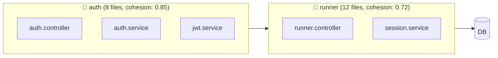
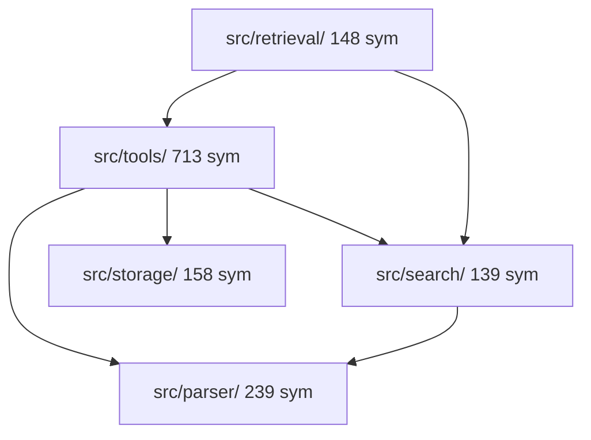
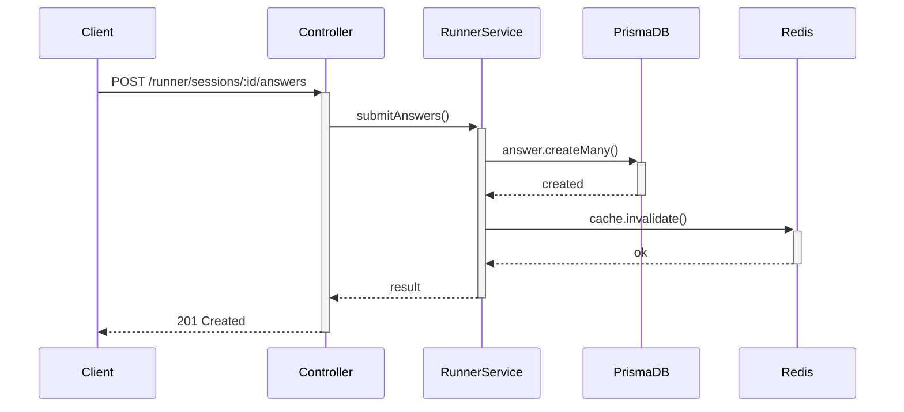

# CodeSift — Quality + Visual Features Spec

**Date:** 2026-03-25
**Scope:** 10 features (5 quality + 5 visual/marketing)
**Estimated effort:** ~24h total

---

## Part A: Quality Features (5 features, ~12h)

### A1. Relevance-Gap Filtering (2h)

**Problem:** `search_symbols` i `search_text` zwracają top-K wyników nawet gdy ostatnie wyniki mają 10x niższy score od pierwszego. Agent dostaje 40 śmieciowych wyników obok 5 trafnych.

**Solution:** Po BM25 scoring, wykryj "gap" — jeśli score następnego wyniku jest <30% score najlepszego, odetnij resztę. Parametr `auto_cutoff: boolean` (default true).

**Algorytm:**
```
scores = [10.5, 9.8, 8.2, 7.1, 2.3, 1.1, 0.8, 0.4]
                                    ↑ gap (2.3/7.1 = 32% drop)
Cutoff at index 4 → return first 4 results
```

Konkretnie: sortuj wyniki po score. Iteruj od góry. Jeśli `score[i] < score[0] * 0.15` (poniżej 15% najlepszego), odetnij od tego miejsca. Minimum 3 wyniki zawsze.

**Files to change:**
- `src/search/bm25.ts` — add `applyCutoff(results)` po sorting
- `src/tools/search-tools.ts` — apply cutoff w `searchSymbols` i propaguj do `searchText` (przez BM25 scoring)

**Benchmark:** Zmierzyć na query "validation" (local/tgm-survey-platform) — ile wyników przed i po cutoff, czy trafne zostają.

---

### A2. include_diff na changed_symbols (2h)

**Problem:** `changed_symbols` zwraca listę symboli które się zmieniły między git refami, ale nie pokazuje CO się zmieniło. Agent musi sam robić `git diff` na każdym pliku.

**Solution:** Dodaj parametr `include_diff: boolean`. Gdy true, dla każdego zmienionego symbolu dołącz unified diff (truncated do 500 chars).

**Implementation:**
```typescript
// W diff-tools.ts:
// Po znalezieniu changed symbols, dla każdego:
const diff = execFileSync("git", [
  "diff", since, until, "--", filePath,
  `-L${sym.start_line},${sym.end_line}:${filePath}`
], { cwd: index.root });
```

Fallback: jeśli line-range diff nie działa, zwróć `git diff since..until -- filePath` truncated do regionu symbolu.

**Files to change:**
- `src/tools/diff-tools.ts` — add `include_diff` option to `changedSymbols()`
- `src/register-tools.ts` — add `include_diff` boolean param

**Benchmark:** `changed_symbols(repo, since="HEAD~3", include_diff=true)` — ile dodatkowych tokenów vs bez diff.

---

### A3. Framework-Aware Dead Code (3h)

**Problem:** `find_dead_code` flaguje React hooks (`useEffect`, `useState`), NestJS lifecycle methods (`onModuleInit`, `onApplicationBootstrap`), Express middleware, i inne framework entry points jako "dead" bo nikt ich nie importuje — ale framework je wywołuje.

**Solution:** Whitelist framework entry points. Symbol jest "alive" jeśli:
1. Ma importerów (current behavior), OR
2. Jest w whitelist frameworkowych entry points

**Whitelists:**
```typescript
const FRAMEWORK_ENTRY_POINTS: Record<string, RegExp[]> = {
  // React
  react: [/^use[A-Z]/, /^(default_?)?export/],
  // NestJS
  nestjs: [
    /^(onModuleInit|onModuleDestroy|onApplicationBootstrap|onApplicationShutdown)$/,
    /^(canActivate|intercept|transform|catch|use)$/,  // Guards, interceptors, pipes, filters, middleware
  ],
  // Express/Koa
  express: [/^(get|post|put|delete|patch|use|all|param)$/],
  // Next.js
  nextjs: [/^(getServerSideProps|getStaticProps|getStaticPaths|generateMetadata|generateStaticParams)$/,
           /^(GET|POST|PUT|DELETE|PATCH|HEAD|OPTIONS)$/,  // Route handlers
           /^(middleware|default)$/],
  // Test
  test: [/^(describe|it|test|beforeEach|afterEach|beforeAll|afterAll)$/],
};
```

**Detection:** Auto-detect framework z index (szukaj `@nestjs/core` w imports, `react` w imports, `next` w file paths). Nie wymaga konfiguracji.

**Files to change:**
- `src/tools/symbol-tools.ts` — modify `findDeadCode()` to check whitelist
- New: `src/utils/framework-detect.ts` — detect framework from index imports

**Benchmark:** Uruchom `find_dead_code` na tgm-survey-platform (NestJS) — ile false positives przed i po.

---

### A4. Scaffolding Detection Pattern (1h)

**Problem:** Kod ma zapomniane TODO markers, placeholder komentarze, Phase/Step markers które miały być tymczasowe. To realny tech debt którego nikt nie szuka.

**Solution:** Dodaj nowy built-in pattern `scaffolding` do `search_patterns`:

```typescript
// Regex patterns:
const SCAFFOLDING_PATTERNS = [
  /\/\/\s*(TODO|FIXME|HACK|XXX|TEMP|TEMPORARY)\b/i,
  /\/\/\s*(Phase|Step|Stage)\s*\d/i,
  /\/\/\s*(placeholder|stub|mock|fake|dummy)\b/i,
  /\/\*\*?\s*(TODO|FIXME|HACK)\b/i,
  /throw new Error\(['"]not implemented['"]\)/i,
  /console\.(log|warn)\(['"]TODO\b/i,
];
```

**Files to change:**
- `src/tools/pattern-tools.ts` — add `scaffolding` to BUILT_IN_PATTERNS map

**Benchmark:** `search_patterns(repo, "scaffolding")` na tgm-survey-platform — ile markers znajduje.

---

### A5. Semantic Chunking (4h)

**Problem:** Obecny chunker (`src/search/chunker.ts`) tnie pliki po stałej liczbie linii (np. 50). Jeśli funkcja ma 80 linii, jest rozbita na 2 chunki — semantic search dostaje pół funkcji.

**Solution:** Chunk na granicach symboli zamiast na stałej liczbie linii. Każdy symbol = 1 chunk. Duże symbole (>100 linii) dzielone na sub-chunki po blokach logicznych (metody w klasie, case w switch).

**Algorytm:**
```
Plik: auth.service.ts (200 linii, 5 symboli)

Old chunking:  [L1-50] [L51-100] [L101-150] [L151-200]
               ← login() rozbity na 2 chunki →

New chunking:  [imports L1-10] [login() L11-60] [refresh() L61-120]
               [logout() L121-150] [getProfile() L151-200]
               ← każdy symbol = 1 spójny chunk →
```

**Implementation:**
- `src/search/chunker.ts` — nowa funkcja `chunkBySymbols(source, symbols)` obok istniejącej `chunkFile()`
- Fallback: jeśli brak symboli (np. plik konfiguracyjny), użyj starego chunker
- Podczas `embedChunks` w `index-tools.ts` — preferuj `chunkBySymbols`

**Files to change:**
- `src/search/chunker.ts` — add `chunkBySymbols()`
- `src/tools/index-tools.ts` — use new chunker in `embedChunks()`

**Benchmark:** Porównaj semantic search quality: "authentication flow" na tgm-survey-platform — old chunks vs symbol chunks. Zmierzyć relevance top-5 wyników.

---

## Part B: Visual/Marketing Features (5 features, ~12h)

### B1. Token Savings Display (2h)

**Problem:** Klient nie widzi wartości CodeSift. Każdy call oszczędza tokeny vs Grep/Read ale to niewidoczne.

**Solution:** Do `_meta` w każdej odpowiedzi dodaj `tokens_saved` estimate. Bazuj na benchmarku: CodeSift avg vs grep avg per tool.

**Baseline multipliers (z benchmarku):**
```typescript
const GREP_EQUIVALENT_MULTIPLIER: Record<string, number> = {
  search_text: 1.5,       // grep returns 50% more tokens
  search_symbols: 1.0,    // parity
  get_file_outline: 3.0,  // Read entire file vs outline
  get_file_tree: 1.25,    // ls vs tree
  find_references: 1.5,   // grep imports
  codebase_retrieval: 3.0, // N sequential calls
  assemble_context: 5.0,  // multiple Read calls
  trace_call_chain: 4.0,  // manual grep chain
};
// tokens_saved = result_tokens * (multiplier - 1)
```

**Display in response (prepended):**
```
⚡ Saved ~1,250 tokens vs manual search ($0.04 at Opus rates)
```

**Cumulative tracking:**
W `usage_stats` tool — dodaj `total_tokens_saved` i `total_cost_saved`.

**Files to change:**
- `src/server-helpers.ts` — add savings estimate to `formatResponse()`
- `src/storage/usage-tracker.ts` — track cumulative savings
- `src/storage/usage-stats.ts` — include savings in report

---

### B2. Mermaid Community Map (2h)

**Problem:** `detect_communities` zwraca JSON — klient nie widzi architektury wizualnie.

**Solution:** Parametr `output_format: "json" | "mermaid"` (default json).

**Output example:**


**Implementation:**
- `src/tools/community-tools.ts` — add `communityToMermaid(result)` function
- Max 15 communities w diagramie (więcej jest nieczytelne)
- Krawędzie: external_edges między communities

**Files to change:**
- `src/tools/community-tools.ts` — add mermaid formatter
- `src/register-tools.ts` — add `output_format` param

---

### B3. Mermaid Dependency Graph (2h)

**Problem:** `get_knowledge_map` zwraca edges JSON — nieczytelny dla człowieka.

**Solution:** Parametr `output_format: "json" | "mermaid"` na `get_knowledge_map`.

**Output example:**


**Implementation:**
- `src/tools/context-tools.ts` — add `knowledgeMapToMermaid(result)`
- Agreguj na poziomie directory (nie file) dla czytelności
- Max 30 nodes, 50 edges

**Files to change:**
- `src/tools/context-tools.ts` — add mermaid formatter
- `src/register-tools.ts` — add `output_format` param

---

### B4. Mermaid Route Flow (2h)

**Problem:** `trace_route` zwraca JSON handler→service→DB — ale klient chce widzieć flow.

**Solution:** Parametr `output_format: "json" | "mermaid"`.

**Output example:**


**Implementation:**
- `src/tools/route-tools.ts` — add `routeToMermaid(result)`
- Sequence diagram (nie graph) — lepiej pokazuje flow
- DB calls jako osobny participant

**Files to change:**
- `src/tools/route-tools.ts` — add mermaid formatter
- `src/register-tools.ts` — add `output_format` param

---

### B5. HTML Report Export (4h)

**Problem:** Wyniki CodeSift giną w konwersacji agenta. Klient/PM potrzebuje dokumentu do przeczytania.

**Solution:** Nowe narzędzie `generate_report(repo)` → standalone HTML z:
- Podsumowanie repo (pliki, symbole, języki)
- Top 10 najkompleksowszych funkcji (z `analyze_complexity`)
- Community map (Mermaid rendered)
- Dead code candidates
- Hotspot files (git churn × complexity)
- Token savings summary

**Implementation:**
- New: `src/tools/report-tools.ts` — orchestrates existing tools
- HTML template z inline CSS (zero zależności, otwiera się w przeglądarce)
- Mermaid.js loaded z CDN dla renderowania diagramów
- Single self-contained .html file

**Output:** Zapisuje do `{repo_root}/codesift-report.html`

**Files to change:**
- New: `src/tools/report-tools.ts`
- `src/register-tools.ts` — register `generate_report`

---

## Implementation Order

| Phase | Features | Effort | Cumulative |
|-------|----------|--------|-----------|
| 1 | A1 (relevance-gap), A4 (scaffolding), B1 (token savings) | 5h | 5h |
| 2 | A2 (include_diff), A3 (framework dead code) | 5h | 10h |
| 3 | B2 (mermaid communities), B3 (mermaid deps), B4 (mermaid route) | 6h | 16h |
| 4 | A5 (semantic chunking), B5 (HTML report) | 8h | 24h |

Each feature: implement → test → benchmark → commit → push.

---

## Success Metrics

| Feature | Metric | Target |
|---------|--------|--------|
| Relevance-gap | % wyników z score >15% top | >80% (vs current ~60%) |
| include_diff | Agent accuracy on "what changed" questions | Qualitative improvement |
| Framework dead code | False positive rate on NestJS repo | <10% (vs current ~40%) |
| Scaffolding | TODO/FIXME markers found per repo | >0 on most repos |
| Semantic chunking | Semantic search relevance (manual eval) | Top-5 precision +20% |
| Token savings | Klient awareness of savings | 100% see message |
| Mermaid outputs | Agent includes diagrams in output | Qualitative |
| HTML report | Standalone readable document | Opens in browser, all data present |
