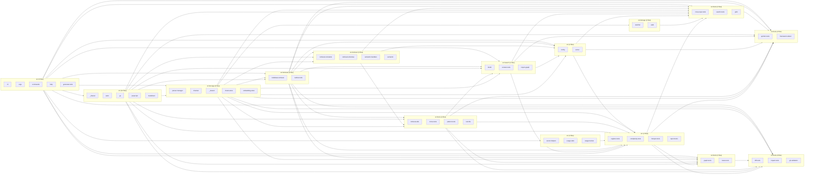

# Architecture — Community Map

```mermaid
graph LR
    subgraph c1["src (12 files)"]
        c1__shared["_shared"]
        c1_astro["astro"]
        c1_go["go"]
        c1_javascript["javascript"]
        c1_markdown["markdown"]
    end
    subgraph c2["src/storage (8 files)"]
        c2_parser_manager["parser-manager"]
        c2_chunker["chunker"]
        c2__shared["_shared"]
        c2_chunk_store["chunk-store"]
        c2_embedding_store["embedding-store"]
    end
    subgraph c0["src (5 files)"]
        c0_cli["cli"]
        c0_args["args"]
        c0_commands["commands"]
        c0_help["help"]
        c0_generate_tools["generate-tools"]
    end
    subgraph c4["src/retrieval (4 files)"]
        c4_retrieval_constants["retrieval-constants"]
        c4_retrieval_schemas["retrieval-schemas"]
        c4_semantic_handlers["semantic-handlers"]
        c4_semantic["semantic"]
    end
    subgraph c5["src/tools (4 files)"]
        c5_retrieval_utils["retrieval-utils"]
        c5_clone_tools["clone-tools"]
        c5_pattern_tools["pattern-tools"]
        c5_test_file["test-file"]
    end
    subgraph c10["src (4 files)"]
        c10_register_tools["register-tools"]
        c10_complexity_tools["complexity-tools"]
        c10_hotspot_tools["hotspot-tools"]
        c10_report_tools["report-tools"]
    end
    subgraph c6["src/search (3 files)"]
        c6_bm25["bm25"]
        c6_context_tools["context-tools"]
        c6_import_graph["import-graph"]
    end
    subgraph c7["src (3 files)"]
        c7_server_helpers["server-helpers"]
        c7_usage_stats["usage-stats"]
        c7_usage_tracker["usage-tracker"]
    end
    subgraph c11["src/tools (3 files)"]
        c11_cross_repo_tools["cross-repo-tools"]
        c11_search_tools["search-tools"]
        c11_glob["glob"]
    end
    subgraph c13["src/tools (3 files)"]
        c13_diff_tools["diff-tools"]
        c13_impact_tools["impact-tools"]
        c13_git_validation["git-validation"]
    end
    subgraph c3["src/retrieval (2 files)"]
        c3_codebase_retrieval["codebase-retrieval"]
        c3_outline_tools["outline-tools"]
    end
    subgraph c8["src (2 files)"]
        c8_config["config"]
        c8_server["server"]
    end
    subgraph c9["src/storage (2 files)"]
        c9_watcher["watcher"]
        c9_walk["walk"]
    end
    subgraph c12["src/tools (2 files)"]
        c12_graph_tools["graph-tools"]
        c12_route_tools["route-tools"]
    end
    subgraph c14["src/tools (2 files)"]
        c14_symbol_tools["symbol-tools"]
        c14_framework_detect["framework-detect"]
    end
    c0 --> c1
    c0 --> c2
    c0 --> c11
    c0 --> c3
    c0 --> c14
    c0 --> c12
    c0 --> c13
    c0 --> c6
    c0 --> c7
    c0 --> c8
    c3 --> c8
    c3 --> c5
    c3 --> c4
    c3 --> c11
    c3 --> c14
    c3 --> c12
    c3 --> c13
    c3 --> c6
    c1 --> c5
    c1 --> c4
    c4 --> c5
    c4 --> c8
    c2 --> c4
    c4 --> c11
    c1 --> c6
    c5 --> c6
    c1 --> c2
    c8 --> c10
    c2 --> c10
    c5 --> c10
    c1 --> c10
    c2 --> c6
    c6 --> c8
    c11 --> c14
    c2 --> c11
    c1 --> c11
    c2 --> c12
    c5 --> c12
    c1 --> c12
    c2 --> c13
    c12 --> c13
    c5 --> c13
    c1 --> c13
    c2 --> c9
    c2 --> c8
    c2 --> c3
    c1 --> c3
    c2 --> c5
    c6 --> c11
    c8 --> c11
    c9 --> c11
    c1 --> c14
    c6 --> c14
    c8 --> c14
    c5 --> c14
    c2 --> c14
    c10 --> c14
    c7 --> c10
    c10 --> c11
    c3 --> c10
    c10 --> c12
    c10 --> c13
    c6 --> c10
    c0 --> c10
```
