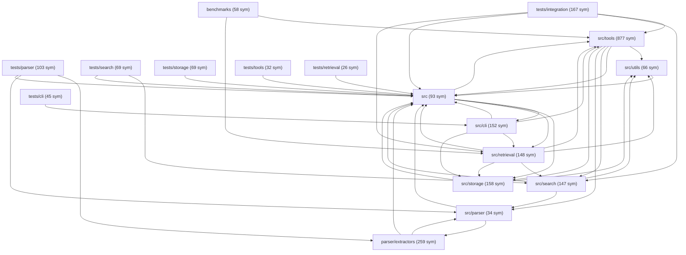

# Dependencies — Module Graph

```mermaid
graph TD
    src_tools["src/tools (877 sym)"]
    src_parser_extractors["parser/extractors (259 sym)"]
    tests_integration["tests/integration (167 sym)"]
    src_storage["src/storage (158 sym)"]
    src_cli["src/cli (152 sym)"]
    src_retrieval["src/retrieval (148 sym)"]
    src_search["src/search (147 sym)"]
    tests_parser["tests/parser (103 sym)"]
    src["src (93 sym)"]
    tests_search["tests/search (69 sym)"]
    tests_storage["tests/storage (69 sym)"]
    src_utils["src/utils (66 sym)"]
    benchmarks["benchmarks (58 sym)"]
    tests_cli["tests/cli (45 sym)"]
    src_parser["src/parser (34 sym)"]
    tests_tools["tests/tools (32 sym)"]
    tests_retrieval["tests/retrieval (26 sym)"]
    benchmarks --> src_tools
    benchmarks --> src_retrieval
    src_cli --> src
    src_cli --> src_tools
    src_cli --> src_retrieval
    src_cli --> src_storage
    src --> src_cli
    src_parser_extractors --> src
    src_parser_extractors --> src_parser
    src_parser --> src
    src_parser --> src_parser_extractors
    src_retrieval --> src
    src_retrieval --> src_tools
    src_retrieval --> src_utils
    src_retrieval --> src_search
    src_retrieval --> src_storage
    src_search --> src_parser
    src_search --> src_utils
    src_search --> src
    src --> src_storage
    src_storage --> src
    src_storage --> src_utils
    src_tools --> src_utils
    src_tools --> src
    src_tools --> src_search
    src_tools --> src_parser
    src_tools --> src_storage
    src_utils --> src
    tests_cli --> src_cli
    tests_integration --> src_tools
    tests_integration --> src_search
    tests_integration --> src
    tests_integration --> src_retrieval
    tests_parser --> src_parser_extractors
    tests_parser --> src_parser
    tests_parser --> src
    tests_retrieval --> src
    tests_search --> src_search
    tests_search --> src
    tests_storage --> src
    tests_tools --> src
    src --> src_tools
    src --> src_retrieval
```
