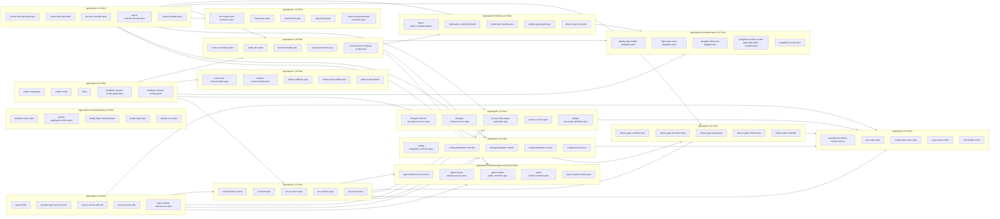

# TGM Survey Platform — API Architecture

```mermaid
graph LR
    subgraph c19["apps/api/src (21 files)"]
        c19_query_limits["query-limits"]
        c19_question_type_cache_service["question-type-cache.service"]
        c19_survey_access_utils_test["survey-access.utils.test"]
        c19_survey_access_utils["survey-access.utils"]
        c19_agent_results_data_service_spec["agent-results-data.service.spec"]
    end
    subgraph c42["apps/api/src (21 files)"]
        c42_circuit_breaker_service["circuit-breaker.service"]
        c42_circuit_breaker["circuit-breaker"]
        c42_env_accessor_spec["env-accessor.spec"]
        c42_env_schema_spec["env.schema.spec"]
        c42_env_schema_test["env.schema.test"]
    end
    subgraph c160["apps/api/src/modules (21 files)"]
        c160_abuse_report_controller_helpers["abuse-report.controller.helpers"]
        c160_moderation_controller_helpers["moderation.controller.helpers"]
        c160_moderation_module_spec["moderation.module.spec"]
        c160_publish_gate_guard_spec["publish-gate.guard.spec"]
        c160_abuse_report_controller["abuse-report.controller"]
    end
    subgraph c116["apps/api/src (21 files)"]
        c116_csv_exporter_pre_extraction_spec["csv-exporter.pre-extraction.spec"]
        c116_export_json_spec["export-json.spec"]
        c116_export_limits_spec["export-limits.spec"]
        c116_export_long_spec["export-long.spec"]
        c116_export_orchestrator_pre_extraction_spec["export-orchestrator.pre-extraction.spec"]
    end
    subgraph c220["apps/api/src (21 files)"]
        c220_question_translation_tracker_service["question-translation-tracker.service"]
        c220_trpc_router_spec["trpc.router.spec"]
        c220_ai_generator_router_spec["ai-generator.router.spec"]
        c220_ai_generator_router["ai-generator.router"]
        c220_benchmark_router["benchmark.router"]
    end
    subgraph c240["apps/api/src/modules/runner (21 files)"]
        c240_display_logic_hidden_navigation_spec["display-logic-hidden-navigation.spec"]
        c240_high_water_mark_navigation_spec["high-water-mark-navigation.spec"]
        c240_navigation_likert_not_skipped_spec["navigation.likert-not-skipped.spec"]
        c240_navigation_resolve_current_page_high_water_complete_spec["navigation.resolve-current-page.high-water-complete.spec"]
        c240_navigation_service_spec["navigation.service.spec"]
    end
    subgraph c82["apps/api/src (21 files)"]
        c82_designer_refactor_translation_service_spec["designer-refactor-translation.service.spec"]
        c82_designer_refactor_service_spec["designer-refactor.service.spec"]
        c82_surveys_loop_merge_guardrails_spec["surveys.loop-merge-guardrails.spec"]
        c82_surveys_service_spec["surveys.service.spec"]
        c82_update_survey_dto_validation_spec["update-survey.dto.validation.spec"]
    end
    subgraph c64["apps/api/src/modules/agent-results (19 files)"]
        c64_agent_results_ai_service_test["agent-results-ai.service.test"]
        c64_agent_results_analysis_service_spec["agent-results-analysis.service.spec"]
        c64_agent_results_public_controller_spec["agent-results-public.controller.spec"]
        c64_agent_results_controller_spec["agent-results.controller.spec"]
        c64_agent_results_module_spec["agent-results.module.spec"]
    end
    subgraph c209["apps/api/src/modules/quality (15 files)"]
        c209_attention_check_spec["attention-check.spec"]
        c209_quality_aggregate_service_spec["quality-aggregate.service.spec"]
        c209_quality_flags_extended_spec["quality-flags-extended.spec"]
        c209_quality_flags_spec["quality-flags.spec"]
        c209_quality_score_spec["quality-score.spec"]
    end
    subgraph c6["apps/api/src (12 files)"]
        c6_cookie_config_spec["cookie.config.spec"]
        c6_cookie_config["cookie.config"]
        c6_index["index"]
        c6_feedback_session_cookie_guard_spec["feedback-session-cookie.guard.spec"]
        c6_feedback_session_cookie_guard["feedback-session-cookie.guard"]
    end
    subgraph c21["apps/api/src (12 files)"]
        c21_cache_control_decorator["cache-control.decorator"]
        c21_public_decorator["public.decorator"]
        c21_preview_throttle_spec["preview-throttle.spec"]
        c21_preview_controller_spec["preview.controller.spec"]
        c21_preview_service_display_scope_spec["preview.service.display-scope.spec"]
    end
    subgraph c324["apps/api/src (12 files)"]
        c324_redirect_url_context_builder_spec["redirect-url-context.builder.spec"]
        c324_redirect_context_builder_spec["redirect-context.builder.spec"]
        c324_redirect_fallback_spec["redirect-fallback.spec"]
        c324_redirect_placeholder_spec["redirect-placeholder.spec"]
        c324_redirect_placeholder["redirect-placeholder"]
    end
    subgraph c20["apps/api/src (11 files)"]
        c20_current_user_decorator_spec["current-user.decorator.spec"]
        c20_current_user_decorator["current-user.decorator"]
        c20_surveys_controller_spec["surveys.controller.spec"]
        c20_export_controller_formats_spec["export-controller.formats.spec"]
        c20_export_controller_spec["export.controller.spec"]
    end
    subgraph c73["apps/api/src (11 files)"]
        c73_coding_integration_controller_spec["coding-integration.controller.spec"]
        c73_coding_integration_controller["coding-integration.controller"]
        c73_coding_integration_module["coding-integration.module"]
        c73_coding_integration_service["coding-integration.service"]
        c73_coding_result_service["coding-result.service"]
    end
    subgraph c148["apps/api/src (11 files)"]
        c148_feature_gate_controller_spec["feature-gate.controller.spec"]
        c148_feature_gate_decorator_spec["feature-gate.decorator.spec"]
        c148_feature_gate_guard_spec["feature-gate.guard.spec"]
        c148_feature_gate_module_spec["feature-gate.module.spec"]
        c148_feature_gate_controller["feature-gate.controller"]
    end
    c6 --> c42
    c42 --> c73
    c42 --> c220
    c42 --> c82
    c42 --> c148
    c21 --> c64
    c20 --> c64
    c19 --> c64
    c42 --> c64
    c6 --> c73
    c20 --> c73
    c21 --> c73
    c73 --> c148
    c19 --> c73
    c20 --> c82
    c19 --> c82
    c20 --> c116
    c20 --> c21
    c20 --> c148
    c20 --> c160
    c21 --> c160
    c19 --> c42
    c21 --> c240
    c160 --> c240
    c6 --> c240
    c6 --> c324
    c6 --> c21
    c73 --> c220
    c82 --> c220
    c19 --> c220
    c148 --> c220
```
